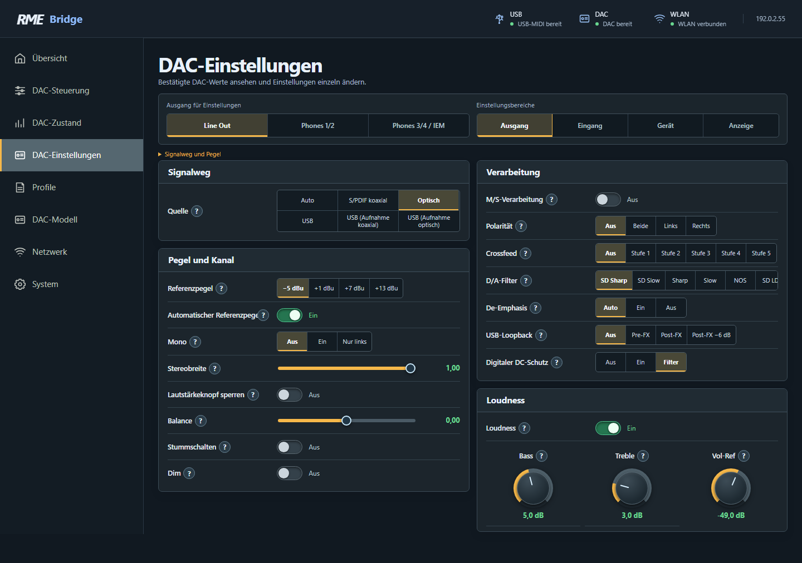
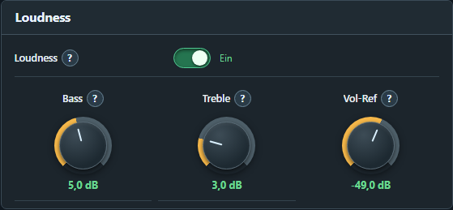
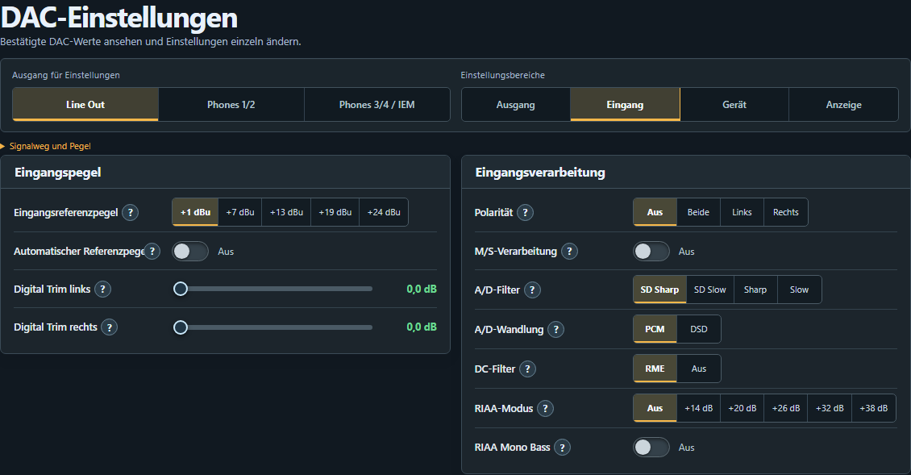
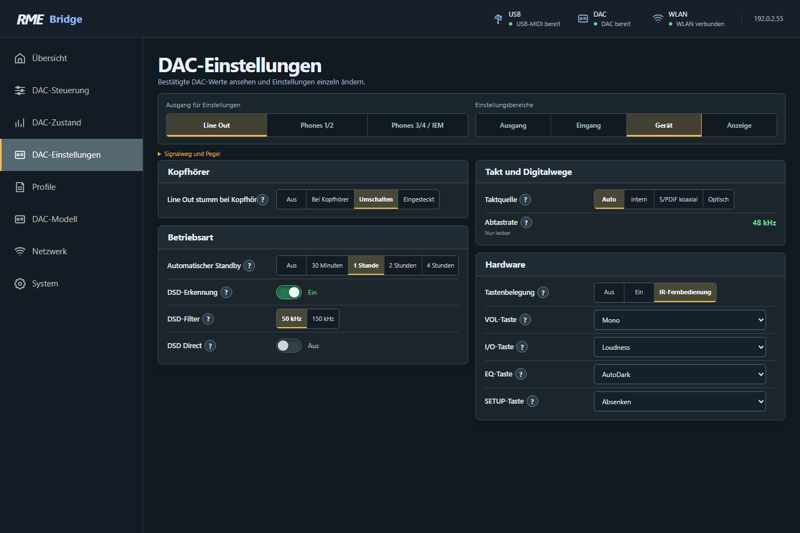
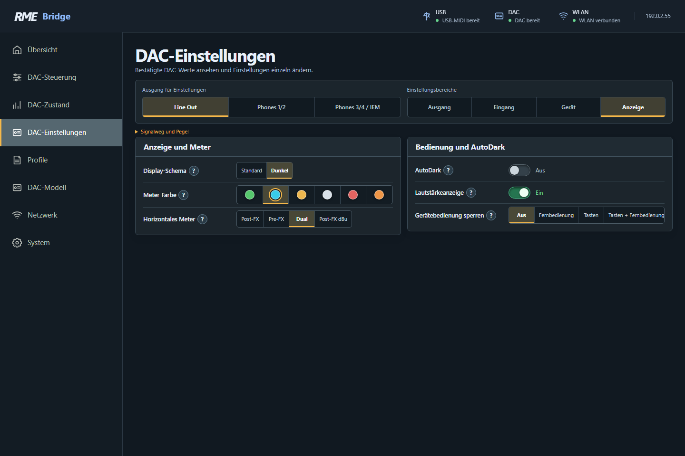

# DAC-Einstellungen verstehen

[← Webseiten](web-interface.md) · [Weiter: Profile und Backup →](profiles.md)

Die Seite **DAC-Einstellungen** hat vier Bereiche: **Ausgang**, **Eingang**, **Gerät** und **Anzeige**. Wähle zuerst das richtige Bearbeitungsziel. Ausgangsoptionen gehören zu diesem Kanal; Geräteoptionen gelten für den DAC insgesamt. Eingangsoptionen beziehen sich auf den analogen Eingang der Pro-Modelle, nicht auf die WLAN-Verbindung.

## Regler und Hilfen bedienen

| Bedienelement | So benutzt du es |
|---|---|
| Schalter | Antippen schaltet Ein/Aus. Die Rückmeldung des DACs bestätigt den Zustand. |
| Tastenfeld | Gewünschte beschriftete Stufe anklicken. Die hervorgehobene Stufe ist die Auswahl. |
| Auswahlliste | Öffnen und einen Eintrag wählen. Es gibt keinen zusätzlichen „Apply“-Knopf für diese normalen Optionen. |
| Schieberegler | Mit Maus oder Finger verschieben. Der Zahlenwert macht die Richtung und Wirkung eindeutig. |
| Drehregler | Gedrückt halten und **nach oben/unten ziehen**. Oben erhöht, unten vermindert; kein Kreis nötig. Mit Mauszeiger über dem Regler wirkt auch das **Mausrad**. Nach Fokussieren sind Pfeiltasten sowie Home/End möglich. |
| **?** | Modellbezogene Hilfe öffnen. Bei komplexen Funktionen enthält sie Wirkungsweise, Besonderheiten und die Referenz auf das passende Handbuch. |

Die drei Loudness-Knöpfe erlauben eine direkte Vorschau; die aktuelle Firmware übernimmt einen gezogenen Wert beim Loslassen, einen Mausrad-/Tastenwert nach kurzer Ruhe. Der DAC bestätigt jede tatsächlich gesendete Änderung. Schnelle Zwischenbewegungen werden zusammengefasst, statt alle alten Zwischenstände nachzusenden. Das ist kein Grund, gleichzeitig von zwei Browsern gegeneinander zu regeln.

Ein schreibgeschützter Wert hat keinen aktiven Regler. Nicht verfügbare Werte fehlen. Ein noch nicht gelesener Wert wird nicht aus einem Profil ergänzt. Änderungen können den tatsächlichen Pegel oder Signalweg beeinflussen – lies bei einer unbekannten Option zuerst **?**.

## Ausgang

### Signalweg, Pegel und Kanal

| Option | Wirkung und praktische Verwendung |
|---|---|
| **Quelle / Source** | Bestimmt die Audioquelle des Bearbeitungsziels. Beim ADI-2 DAC: Auto, koaxial, optisch und USB-Varianten. Pro-Modelle ergänzen je nach Modus AES, Analog und USB-Kanalpaare. Für die Standalone-Bridge eine Quelle wählen, die tatsächlich Audio erhält; die Bridge liefert kein USB-Audio. |
| **Hinterer TRS-Ausgang / Rear TRS output** | ADI-2/4 Pro SE, soweit im gewählten Pfad verfügbar: ordnet die hinteren TRS-Ausgänge Line 1/2 oder Phones 3/4 zu. Ändert echtes Routing, nicht nur eine Bildschirmbeschriftung. |
| **Referenzpegel / Reference level** | Legt eine analoge Hardware-Pegelstufe fest. DAC-Line-Stufen sind −5, +1, +7, +13 dBu; Pro-Line-Stufen +4, +13, +19, +24 dBu. Phones verwendet modellabhängige IEM-/Lo-/Hi-Power-Stufen. Kein Ersatz für eine kleine Volume-Änderung: Eine Stufe kann den Ausgang deutlich lauter machen. |
| **Automatischer Referenzpegel / Auto Ref Level** | Passt die analoge Stufe während der Lautstärkeregelung an. Das nutzt den Dynamikbereich sinnvoll; ein Wechsel kann leise klicken. Bei ausgeschalteter Automatik den tatsächlichen Pegel nach einem manuellen Referenzwechsel neu prüfen. |
| **Mono** | Summiert das Stereosignal. „Nur links“ gibt die Summe nur am linken Kanal aus. Für normales Stereo ausgeschaltet lassen. |
| **Stereobreite / Stereo width** | 1,00 = normales Stereo; 0,00 = Mono; −1,00 vertauscht links/rechts. Zwischenwerte verändern den Stereoanteil. Kein Crossfeed-Ersatz. |
| **Balance** | Verschiebt das Verhältnis zwischen links und rechts. 0,00 ist die Mitte. Zum bewussten Ausgleichen einer Kette oder zum Einzelabhören; nicht versehentlich als Gesamtlautstärke benutzen. |
| **Lautstärkeknopf sperren / Lock volume knob** | Sperrt die normale Bedienung des betreffenden Pegels am physischen Volume-Knopf. Dies ist weder eine PIN-Sperre der Bridge-Webseite noch eine allgemeine Lautstärkegrenze. |
| **Stummschalten / Mute** | Schaltet den entsprechenden DAC-Pfad stumm. Das ist echtes DAC-Mute, kein Abspielbefehl an eine Musiksoftware. |
| **Dim** | Reduziert den Pegel vorübergehend nach der DAC-Dim-Funktion. Die vorherige Hörlautstärke lässt sich durch Ausschalten wieder erreichen. Anders als Mute bleibt ein Signal hörbar. |

**dB und dBu sind nicht dasselbe.** Die große Volume-Zahl ist eine relative Pegelregelung des DACs. dBu bezeichnet die analoge Referenz. Bei manuellem Wechsel der Referenz kann sich die tatsächliche Lautstärke ändern, obwohl die Volume-Zahl gleich bleibt. Die Webseite arbeitet nicht mit einem Prozent-Lautstärkewert.

### Verarbeitung

| Option | Wirkung und praktische Verwendung |
|---|---|
| **M/S-Verarbeitung** | Kodiert normales Stereo zu Mitte/Seite bzw. dekodiert ein M/S-Signal zu Stereo. Mitte ist L+R, Seite L−R. Bei normaler Musik meist aus; die Option kann sonst Mono-/Stereoanteile auf andere Kanäle verteilen. |
| **Polarität** | Kehrt die Polarität von links, rechts oder beiden Kanälen um. Nicht mit Balance, Kanaltausch oder einer zeitlichen Verzögerung verwechseln. |
| **Crossfeed** | Mischt einen gefilterten Anteil des jeweils anderen Kanals zu. Für Kopfhörer gedacht, um extrem getrennte Links-/Rechtsabbildung weniger künstlich wirken zu lassen. Die fünf Stufen werden unten erklärt. |
| **D/A-Filter** | Wählt das Rekonstruktionsfilter des Wandlers. Auswahl und Verfügbarkeit hängen von Modell, Wandler und Abtastrate ab. Filterdetails siehe unten. |
| **De-Emphasis** | Korrigiert ausdrücklich vorbetontes Audiomaterial. Auto folgt dessen Kennung im Digitalsignal. Erzwungenes Ein bei normaler Musik senkt die Höhen unerwünscht. Bei NOS kann die Funktion entfallen. |
| **USB-Loopback** | Führt ein Ausgangssignal in USB-Aufnahmekanäle zurück. Pre-FX ist vor, Post-FX nach der Verarbeitung; es liegt weiterhin vor Volume. In diesem Bridge-Aufbau gibt es keinen USB-Audio-Aufnahmehost. Die Funktion erzeugt keine Aufnahme in der Bridge. |
| **Digitaler DC-Schutz** | Aus/Ein/Filter beeinflusst den Schutz gegen Gleichanteile am Analogausgang. Ein kann bei zu hohem DC stummschalten; Filter entfernt DC/Infraschall. Auch bei Aus kann die DAC-Erkennung mit Warnung weiter aktiv sein. Nicht als Bass-Klangregler missverstehen. |

### Crossfeed und seine fünf Stufen

Crossfeed ist kein Raumklang- oder Hall-Effekt. Die Bauer-Binaural-Verarbeitung nutzt Frequenzbegrenzung, geringe Verzögerung und Pegelanpassung. Die Dämpfungsangabe betrifft den **hinzugemischten Anteil**, nicht eine pauschale Absenkung deiner Musik. Weniger Dämpfung bedeutet einen stärkeren Crossfeed-Effekt.

| Auswahl | Frequenz | Hinzugemischter Anteil | Einordnung |
|---|---|---|---|
| Aus | — | Keiner | Unveränderte Trennung |
| Stufe 1 | 650 Hz | −13 dB im DAC-Handbuch; −13,5 dB in den Pro-Handbüchern | Sehr zurückhaltend |
| Stufe 2 | 650 Hz | −9,5 dB | Jan-Meier-Charakteristik |
| Stufe 3 | 700 Hz | −6 dB | Chu-Moy-Charakteristik |
| Stufe 4 | 700 Hz | −4,5 dB | Lautsprecherähnlicher Eindruck; RME nennt 30°/3 m |
| Stufe 5 | 700 Hz | −3 dB | Stärkste angebotene Beimischung |

Die Zahlen folgen den bereitgestellten Gerätehandbüchern: ADI-2 DAC v1.8, Kapitel 8.6; ADI-2 Pro FS R v3.8 und ADI-2/4 Pro SE v1.3, Crossfeed-Kapitel. Beginne beispielsweise bei Stufe 1 oder 2, vergleiche bei ähnlicher Hörlautstärke mit Aus und wähle nach Gehör. Eine aktivierte Einstellung bedeutet nicht, dass sie in jedem Sondermodus oder bei jeder hohen Abtastrate wirkt.

### D/A- und A/D-Filter einordnen

**Sharp**-Varianten begrenzen hohe Frequenzen steiler, **Slow**-Varianten lassen den obersten Frequenzbereich früher abfallen. **SD** steht für eine kürzer verzögernde Filterfamilie; Impulsantwort und Latenz unterscheiden sich. **NOS** hat ein anderes Hochton- und Impulsverhalten und deaktiviert bei entsprechenden Modellen De-Emphasis. **SD LD** und **Brickwall** sind zusätzliche modellabhängige Auswahlmöglichkeiten. Die Liste auf deiner Bridge ist entscheidend; es gibt keinen für alle Geräte gleich benannten „besten“ Filter.

Bei Pro-Modellen kann die Filterwahl bei sehr hohen Abtastraten gesperrt sein. Das Gerät benutzt dann ein festes Filter. Für einen hörbaren Vergleich keine unterschiedlichen Referenzpegel oder Volume-Werte gleichzeitig ändern. Die Handbücher erläutern die Messkurven; der **?**-Text nennt den zum erkannten Modell passenden Zusammenhang.

### Loudness mit drei Drehreglern

Loudness gleicht den bei leiser Wiedergabe schwächer wahrgenommenen Bass- und Höhenanteil aus. Sie ist **keine feste Bassanhebung**: Der Effekt nimmt mit steigender DAC-Lautstärke ab. Die Regler gehören zum gewählten Ausgang.

| Einstellung | Bedeutung |
|---|---|
| **Loudness Ein/Aus** | Aktiviert oder deaktiviert die Korrektur. |
| **Bass** | Maximale Bassanhebung: +1 bis +10 dB in 0,5-dB-Schritten. Nicht der separate Bass/Treble-Klangregler. |
| **Treble** | Maximale Höhenanhebung: +1 bis +10 dB in 0,5-dB-Schritten. |
| **Vol-Ref** | DAC-Lautstärke, bei oder unter der die volle Anhebung wirkt: −90 bis −20 dB in 0,5-dB-Schritten. |

**Beispiel:** Bass +5 dB, Treble +3 dB, Vol-Ref **−49 dB**. Bei −49 dB und leiser wirken die gewählten maximalen Anhebungen. Beim Lauterstellen nimmt die Korrektur über die nächsten 20 dB kontinuierlich ab; bei **−29 dB** ist sie null. „Vol-Ref −49 dB“ stellt also **nicht** die Ausgangslautstärke auf −49 dB und ist auch keine Lautstärkeobergrenze.

Wähle Vol-Ref etwa bei deiner leisesten üblichen DAC-Hörlautstärke. Stimmen Bass und Höhen dort für dich, prüfe auch lautere Wiedergabe. Nach einem manuellen analogen Referenzwechsel mit Auto Ref Level Aus kann eine neue Abstimmung nötig sein. DSP-Sondermodi wie DSD Direct begrenzen die Wirkung; der Schalter allein hebt solche Grenzen nicht auf.

## Eingang bei ADI-2 Pro und ADI-2/4 Pro SE

| Option | Wirkung und praktische Verwendung |
|---|---|
| **Eingangsreferenzpegel** | Analoge Empfindlichkeit bzw. Pegelreserve des Eingangs. Nicht mit Ausgangs-Volume verwechseln. Vor einer Änderung Quelle und tatsächlichen Pegel am DAC kontrollieren; Modellbeschriftungen sind nicht zwischen Pro-Familien austauschbar. |
| **Automatischer Referenzpegel** | Passt die Eingangsstufe bei Übersteuerung an. Hilft gegen Clipping, ersetzt aber keine saubere Pegelanpassung des Zuspielers. |
| **Digital Trim links/rechts** | Getrennte digitale Verstärkung des Eingangs, 0 bis +6 dB in 0,5-dB-Schritten. Zusätzliche Verstärkung reduziert Headroom; nur bewusst verschiedene Kanalwerte wählen. |
| **Polarität** | Dreht links, rechts oder beide Eingangskanäle um. |
| **M/S-Verarbeitung** | Mitte/Seite-Umrechnung auf dem Eingangspfad. Nur bei entsprechendem Material bzw. gezielter Analyse verwenden. |
| **A/D-Filter** | Modell- und abtastratenbezogene Filterwahl bei Analog-Digital-Wandlung; nicht dasselbe wie das Ausgangs-D/A-Filter. |
| **A/D-Wandlung PCM/DSD** | Wählt die Aufzeichnungsart. DSD ist an geeignete Abtastraten und Routingbedingungen gebunden. Die Bridge ist kein Aufnahmeprogramm. |
| **DC-Filter** | Entfernt Gleichanteile im Eingang. Pro bietet modellabhängige Auto-/ADC-/RME-Stufen, 2/4 Pro SE seine eigene Auswahl. In bestimmten DSD-Modi kann ein Filter inaktiv sein. |
| **RIAA-Modus** | Nur 2/4 Pro SE: für Moving-Magnet-Plattenspieler mit RIAA-Entzerrung und Verstärkungsstufen. Nicht für eine normale Line-Quelle einschalten. Der interne Plattenspielerbetrieb verändert weitere Eingangseinstellungen. |
| **RIAA Mono Bass** | Nur 2/4 Pro SE: summiert im RIAA-Betrieb Bassanteile unter 150 Hz zu Mono. Kann Rumpel- und Rückkopplungsanteile vermindern. Keine allgemeine Mono-Einstellung für die ganze Musik. |

Im RIAA-Modus sind manuelle Eingangsreferenz und deren Automatik nicht wie bei Line-Betrieb nutzbar; der passende DC-Filter bleibt aktiv. Wähle RIAA-Gain anhand der **Pegelanzeige des DACs**, nicht anhand der Bridge-Lautstärkezahl. Die Bridge liefert keinen Aufnahmepegelmesser.

## Gerät

### Betriebsart und DSD

| Option | Wirkung und praktische Verwendung |
|---|---|
| **Automatischer Standby** | Aus, 30 Minuten, 1, 2 oder 4 Stunden. Der DAC geht nach seinen Bedingungen für Inaktivität und fehlendes relevantes Audio in Standby. Dies schaltet nicht die Bridge ab. |
| **DSD-Erkennung** | Erkennung von DSD-Signalen an digitalen Eingängen aktivieren/deaktivieren. |
| **DSD-Filter** | Verfügbare Hochfrequenzfilter begrenzen Ultraschallrauschen bei DSD. Kein Klangfilter für normales PCM. |
| **DSD Direct** | Soweit vom Modell angeboten: umgeht DSP und normale digitale Lautstärkeregelung für die hinteren Ausgänge. Vor Aktivierung nachgeschaltete Verstärkung absichern; eine digitale Volume-Zahl ist dann kein ausreichender Schutz. |
| **Grundmodus / Basic Mode** | Pro-Modelle: Auto, AD/DA, USB, Vorverstärker, Digital Through, DAC. Bestimmt die Signalwege und weitere Optionen. Die Bridge-USB-Verbindung ist dabei eine echte angeschlossene USB-Verbindung, liefert aber kein Audio. |
| **Digitalausgangsquelle** | Pro-Modelle: Standard oder bearbeiteter Main-Out-Pfad. „Main Out“ kann DSP und Lautstärkeregelung auf Digitalausgänge übertragen; das ist echtes Audio-Routing. |

**AutoDark ist kein Standby.** Bei AutoDark bleibt die Audiofunktion aktiv und die Anzeige wird nur verborgen. Auto Standby versetzt den DAC in den Ruhemodus; die Bridge muss zum erneuten Einschalten einen IR-Sender haben oder du bedienst den DAC selbst.

### Kopfhörer und Umschaltverhalten

| Option | Wirkung und praktische Verwendung |
|---|---|
| **Line Out stumm bei Kopfhörer** | ADI-2 DAC: Aus lässt gegebenenfalls mehrere Ausgänge aktiv; Bei Kopfhörer reagiert auf Stecker. **Umschalten** entspricht Toggle Ph/Line, **Eingesteckt** Toggle plugged. Diese beiden Modi sind Voraussetzungen des separaten Bridge-Umschaltknopfs. |
| **Dual Phones** | Pro-Modelle: aktiviert den zusätzlichen Kopfhörerpfad Phones 1/2 neben Phones 3/4. Je nach Anschluss und Modus können Pfade gekoppelt arbeiten. |
| **Symmetrischer TRS-Kopfhörer** | Pro-Modelle: verwendet beide TRS-Buchsen als getrennte symmetrische Links-/Rechtskanäle. Nur passend verdrahtete Kopfhörer anschließen, nicht zwei gewöhnliche Stereokopfhörer. Beim 2/4 Pro SE kann Pentaconn diesen Modus zusätzlich beeinflussen. |
| **Kopfhörer/Line umschalten** | Pro-Modelle: legt die Ziele der geräteeigenen Toggle-Funktion fest. Die Auswahl konfiguriert die Funktion; sie löst nicht selbst einen Wechsel aus. |
| **Line stumm bei Phones 1/2** | Pro-Modelle: Reaktion auf einen erkannten Stecker; setzt für den zusätzlichen Pfad passende Dual-Phones-Konfiguration voraus. |
| **Line stumm bei Phones 3/4** | Pro-Modelle: schaltet den Line-Pfad bei entsprechenden Kopfhörern stumm. |

Der DAC verwaltet seine analogen Buchsen selbst. Die Bridge stellt passende MIDI-Optionen dar, ersetzt aber weder Buchsenerkennung noch die geräteinternen Rampen und Schutzfunktionen. Insbesondere darf ein symmetrischer Kopfhörermodus nicht mit unpassender Verkabelung ausprobiert werden.

### Takt und Digitalwege

| Option | Wirkung und praktische Verwendung |
|---|---|
| **Taktquelle / Clock Source** | Auto, intern oder modellabhängiger Digitaleingang. Stimmt die Wandlung auf die benötigte Clock ab. Im Pro-DAC-Grundmodus kann die Auswahl durch das Gerät vorgegeben sein. |
| **Abtastrate / Sample Rate** | Der vom DAC gemeldete Wert. Über diese angeschlossene USB-Verbindung wird er auf der Bridge **nur gelesen**, nicht mit einem Regler erzwungen. |
| **S/PDIF-Eingang** | Pro-Modelle: Auswahl des koaxialen/optischen Digitalwegs bzw. Automatik. Nicht mit der Quelle eines einzelnen Ausgangs verwechseln. |
| **Sample-Rate-Converter (SRC)** | Pro-Modelle: wandelt AES oder S/PDIF auf den Gerätetakt. Hilft beim Verbinden unterschiedlicher Digitalklocken. Er fügt durch Upsampling keine neue musikalische Information hinzu. |
| **SRC-Pegel** | 0 oder −3 dB, soweit angeboten. −3 dB schafft Reserve für Intersample-Spitzen in der konvertierten Digitalkette. Kein analoger Volume-Regler. |
| **Optischer Ausgang** | Pro-Modelle: S/PDIF oder ADAT. Empfänger und Übertragungsformat müssen dazu passen. |

### Tastenbelegung

**Tastenbelegung** kann aus, am Gerät und an der Fernbedienung oder nur für IR aktiv sein. Die folgenden Listen definieren die Aktionen für **VOL**, **I/O**, **EQ**, **SETUP**; Pro-Geräte ergänzen passende **IR-Tasten 5, 6 und 7**. Eine Zuweisung verändert, was ein späterer Tastendruck tut – sie ist nicht schon der Druck auf diese Taste.

Die Listen können vorhandene Aktionen wie Mono, Dim, Loudness, Crossfeed oder eine Filterwahl enthalten. Ebenso können geräteinterne Setup-/EQ-Aktionen zugewiesen werden. Das bedeutet **nicht**, dass die Bridge EQ-Kurven oder Setup-Inhalte speichert oder bearbeitet. Wird eine solche Taste später betätigt, gelten die Auswirkungen und gespeicherten Werte des DACs, gegebenenfalls auch andere Pegel. Prüfe bei ungewöhnlicher Tastenreaktion zuerst diese Zuordnung.

## Anzeige

| Option | Wirkung |
|---|---|
| **Display-Schema** | Standard oder Dunkel für die Anzeige des DACs. Schaltet das Display nicht aus. |
| **Meter-Farbe** | Die vom Gerät angebotenen sechs Farben: Grün, Cyan, Bernstein, Monochrom, Rot, Orange. Farbpunkt auswählen; nicht mit den neun Website-Akzenten verwechseln. |
| **Horizontales Meter** | Pre-FX vor DSP/Volume, Post-FX danach, Dual beide, ggf. Post-FX dBu mit analogbezogenem Wert. Die dünne äußere Linie im Dual-Modus steht für Pre. Diese Einstellung gilt dem Meter auf dem DAC, nicht einem Meter auf der Bridge-Webseite. |
| **AutoDark** | Blendet Display und LEDs nach Inaktivität aus; Wiedergabe läuft weiter. Bedienung oder Warnungen können die Anzeige vorübergehend wecken. |
| **Lautstärkeanzeige / Volume screen** | Aktiviert das entsprechende große Volume-Anzeigebild des DACs. Verändert nicht den Pegel. |
| **Gerätebedienung sperren / Lock UI** | Sperrt je nach Auswahl Fernbedienung, Tasten oder beides. Kein Zugriffsschutz der Website. Vor Aktivierung merken, wie die Sperre am eigenen DAC aufgehoben wird. |

## Ein sinnvoller Bedienablauf

Für eine kleine Anpassung beim Kopfhörerhören: zunächst den wirklichen Kopfhörerpfad als Bearbeitungsziel wählen und die gegebenenfalls laufende Absenkung abwarten. Dann beispielsweise Crossfeed Stufe 1 einschalten und vergleichen. Erst danach Loudness aktivieren und Bass, Treble, Vol-Ref abstimmen. Quelle, Referenzpegel und Betriebsart nicht gleichzeitig verändern; sonst lässt sich die Wirkung einer einzelnen Option kaum beurteilen.

Für eine reine Kontrolle ohne Änderung öffne **DAC-Zustand**. Zum Aufbewahren von AutoDark und Volume verwende ein **Bridge-Profil**. Für eine vollständige Sicherung der gesamten DAC-Konfiguration einschließlich EQ ist die passende RME-Remote-Funktion nötig, nicht das Profilbackup der Bridge.

[Weiter: Profile und Backups →](profiles.md)
