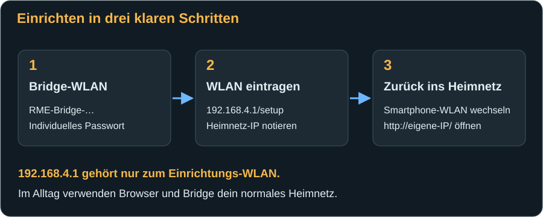
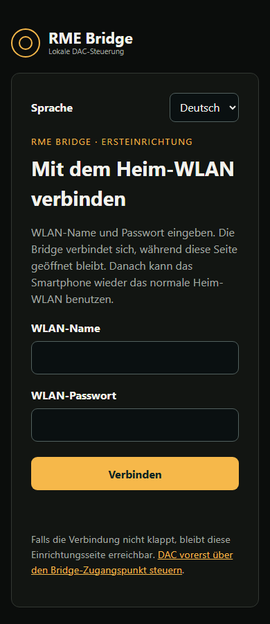

# Erster Start: WLAN und DAC verbinden

[← Installation](installation.md) · [Weiter: Die Webseiten →](web-interface.md)

Nach dem Flashen bleibt die Bridge zunächst am Computer. So kannst du ihre Startmeldungen lesen. Der DAC darf für die WLAN-Einrichtung noch ausgeschaltet oder getrennt sein.

## Das Einrichtungs-WLAN öffnen

1. Notiere WLAN-Name und individuelles Passwort aus der [seriellen Startmeldung](installation.md#4-das-einrichtungs-passwort-ablesen). Der Name hat die Form `RME-Bridge-A1B2C3`; die letzten Zeichen unterscheiden die Geräte.
2. Öffne die WLAN-Auswahl deines Smartphones oder Computers und verbinde dich mit **diesem Bridge-WLAN**, nicht schon mit deinem Heim-WLAN. Gib das notierte Bridge-Passwort ein. Es ist **nicht** das Passwort deines Routers.
3. Falls das Smartphone „Kein Internet“ meldet, bleibe trotzdem in diesem WLAN. Das ist normal: Die Bridge ist keine Internetverbindung. Automatisches Wechseln zu mobilen Daten oder einem anderen WLAN kann den nächsten Schritt verhindern.
4. Öffne im Browser genau **`http://192.168.4.1/setup`**. Tippe die Adresse in die Adresszeile, nicht in eine Suchmaschine. Verwende `http`, nicht `https`.
5. Es muss ein Formular mit **WLAN-Name**, **WLAN-Passwort** und **Verbinden** erscheinen. Siehst du nur die DAC-Seite mit „Heim-WLAN nicht verbunden“, öffne ausdrücklich den Pfad **`/setup`**.

## Dein Heim-WLAN eintragen

1. Wähle bei Bedarf bereits hier **Deutsch** oder **Englisch**. Diese Wahl gilt auch für die normalen Bridge-Seiten.
2. Trage den **exakten Namen** deines 2,4-GHz-WLANs ein. Die Seite ist ein Eingabeformular, keine WLAN-Auswahlliste. Groß-/Kleinschreibung und Leerzeichen gehören zum Namen. Ein verstecktes WLAN muss genauso exakt eingetragen werden.
3. Gib das **Heim-WLAN-Passwort** ein. Dieses zweite Passwort verbindet die Bridge mit dem Router. Normale WLAN-Schlüssel dürfen 8 bis 63 Zeichen haben; als Sonderfall wird ein 64-stelliger hexadezimaler Schlüssel akzeptiert. Ein offenes WLAN oder ein Unternehmensnetz mit zusätzlichem Benutzernamen ist nicht dieser Einrichtungsweg.
4. Drücke **Verbinden** einmal. Die Bridge speichert die Daten und baut die Verbindung auf, während du im Bridge-WLAN bleibst. Das Passwortfeld wird anschließend geleert; das ist kein Verlust der gespeicherten Daten.
5. Warte auf **„Bridge im Heim-WLAN erreichbar“** und die angezeigte Adresse, beispielsweise `http://192.168.1.50/`. Notiere **deine** Adresse. Das Formular allein ist noch keine erfolgreiche Verbindung.
6. Nach etwa 30 Sekunden ohne Erfolg erscheint ein Hinweis. Prüfe Name, Passwort, 2,4-GHz-Verfügbarkeit und Routerzugriff und speichere korrigierte Daten. Die Einrichtungsseite bleibt für diesen Fall erreichbar.

Der WLAN-Name ist auf 32 Bytes begrenzt; Namen mit Sonderzeichen können diese Grenze schon mit weniger als 32 sichtbaren Zeichen erreichen. Die Bridge erhält ihre IP automatisch vom Router (DHCP). Eine feste IP lässt sich nicht auf der Bridge-Webseite eintragen; bei Bedarf richtest du eine DHCP-Reservierung für die Bridge im Router ein.

## Zurück ins Heim-WLAN wechseln

1. Verbinde das Smartphone wieder mit deinem **normalen Heim-WLAN**.
2. Öffne die soeben angezeigte **Heimnetz-IP** der Bridge. `192.168.4.1` ist nur ihre Adresse im Einrichtungs-WLAN.
3. Die **Übersicht** muss erscheinen und der WLAN-Status muss verbunden sein. **Netzwerk** zeigt Adresse, Netzwerkname und Signalstärke erneut an. Speichere die normale Adresse als Browser-Lesezeichen.

Der geschützte Einrichtungszugang wird nach erfolgreicher Heimnetzverbindung automatisch beendet: frühestens nach ungefähr zwei Minuten ohne verbundene AP-Geräte, spätestens nach ungefähr zehn Minuten auch bei noch verbundenem Smartphone. Wechsle deshalb nach dem Ablesen der IP zeitnah zurück.

Die Webseite benötigt für die alltägliche Bedienung keine Internetverbindung. Für die genaue Uhrzeit im Ereignislog benötigt die Bridge allerdings Zugang zu einem Internet-Zeitserver. Ohne synchronisierte Uhr bleibt die Laufzeit seit dem Start nutzbar.

## Wenn du das WLAN später ändern möchtest

Das Formular zum Speichern neuer WLAN-Zugangsdaten ist **nur über den geschützten Bridge-Zugangspunkt** nutzbar. Die normale Netzwerkseite im Heimnetz ist eine Statusanzeige; sie zeigt keine Passwörter an.

Ist das bisher gespeicherte Heim-WLAN länger als ungefähr 30 Sekunden nicht erreichbar, öffnet die Bridge ihren Zugangspunkt erneut und versucht gleichzeitig weiter, das Heim-WLAN zu erreichen. Verbinde dich dann mit dem bekannten AP-Namen und dem aufbewahrten AP-Passwort und öffne `/setup` wie oben. Beispielsweise kann dies nach einem Routerwechsel eintreten. Wenn nötig, mache das bisherige WLAN vorübergehend nicht erreichbar; lösche die Bridge nicht vorschnell komplett.

Die Bridge verwendet dabei weiterhin ihr gespeichertes AP-Passwort. Wiederkehrendes WLAN ist kein Werksreset. Nach neuer erfolgreicher Einrichtung gilt wieder die angezeigte Heimnetz-IP.

## Den DAC vorbereiten

### Audioeingang und sichere Pegel

Lass den DAC an seinem eigenen Netzteil und schalte ihn am Gerät ein. Beginne mit leisem oder stummgeschaltetem Abhörsystem. Audio muss getrennt von der Bridge ankommen, beispielsweise optisch oder koaxial. Am ADI-2 DAC kann **Source Auto** bei angeschlossenem USB auch die USB-Quelle auswählen. Da die Bridge kein Audio liefert, wähle für deinen tatsächlichen Signalweg beispielsweise **Optisch** oder **S/PDIF koaxial**.

Bei Pro-Modellen zusätzlich den Grundmodus prüfen: Die vorhandene USB-Verbindung kann eine automatische Moduswahl beeinflussen. Wähle Betriebsart und Quelle passend zur gewünschten Wiedergabe und orientiere dich am RME-Gerätehandbuch.

### MIDI Control einschalten

Die USB-Verbindung allein genügt nicht. Aktiviere am **DAC selbst** die RME-Option **MIDI Control = ON**:

| Gerät | Wo du die Option suchst |
|---|---|
| ADI-2 DAC / DAC FS | **SETUP → Options → Remap Keys / Diag** bzw. Remap Keys / Diagnosis |
| ADI-2 Pro | **Device Mode** im SETUP-/Options-Bereich |
| ADI-2/4 Pro SE | **Device Mode** im SETUP-/Options-Bereich |

Bewege dich mit den Bedienelementen des DACs durch das jeweilige Menü und suche die Einstellung nach ihrem Namen. Menüumfang und Darstellung hängen von der DAC-Firmware ab. Fehlt **MIDI Control** ganz, prüfe die Modell- und Firmwareunterstützung bei RME. Die [RME-Downloadseite](https://rme-audio.de/Downloadbereich.html) enthält Gerätehandbücher und Herstellerupdates. Ein RME-Firmwareupdate erfolgt nach RME-Anleitung am Computer, nicht über diese Bridge.

Diese Voraussetzung und die Menüzuordnung beschreibt auch das [RME-Handbuch zur ADI-2 Remote](https://rme-audio.de/downloads/adi2remote_d.pdf). Du musst die Remote-App nicht parallel benutzen; Bridge und Computer können den DAC-USB-Anschluss ohnehin nicht gleichzeitig belegen.

## Das USB-Kabel zum DAC anschließen

1. Prüfe noch einmal die [Buchsenzuordnung](installation.md#die-beiden-usb-buchsen-nicht-verwechseln).
2. Eventuelle bisherige USB-Verbindung des DACs zum Computer oder Streamer trennen.
3. USB-C-auf-USB-B-Datenkabel **native USB-Buchse der Bridge → USB-B des DACs** verbinden. Die UART-Buchse versorgt weiterhin die Bridge.
4. Öffne die Bridge-Webseite. Die Anzeigen wechseln von USB erkannt zu **USB-MIDI bereit**; das Modell erscheint und der DAC-Status wird **DAC bereit**. Modellbild allein und „USB erkannt“ reichen noch nicht als Nachweis einer funktionierenden MIDI-Steuerung.
5. Fehlen Werte, warte kurz auf die erste Abfrage. Unter **System → DAC-Zustand neu abfragen** kannst du eine neue lesende Abfrage anstoßen. Das setzt keine Einstellungen zurück.

## Die erste kleine Bedienung

Wenn „DAC bereit“ und ein bestätigter Lautstärkewert angezeigt werden:

1. Öffne **DAC-Steuerung** und prüfe, dass **Line Out** das gewünschte Bearbeitungsziel ist. Vergleiche den großen dB-Wert mit der Anzeige am DAC.
2. Drücke einmal **−0,5 dB**. Beispielsweise wird aus −67,5 dB nun −68,0 dB: Die Zahl wird negativer und die Lautstärke leiser.
3. Warte auf den bestätigten Wert. Drücke für den Rückweg einmal **+0,5 dB**.
4. Wenn das DAC-Display mit AutoDark ausgeblendet ist, schalte **AutoDark aus**, um den Wert bequem abzulesen. Wecke die Anzeige nicht durch eine unbeabsichtigte Lautstärkeänderung.

Prüfe vor einer Änderung das erkannte Modell, das Bearbeitungsziel und den aktuellen DAC-Wert. Für die modellbezogenen Optionen ist der Bereich **DAC-Einstellungen** maßgeblich. Bei Fehlern oder abweichenden Werten anhalten, aktuellen Status lesen und [die Fehlerhilfe](troubleshooting.md) verwenden.

## Danach: Ohne Computer betreiben

Nach erfolgreicher Einrichtung kannst du das Datenkabel an der UART-Buchse gegen die normale stabile USB-Versorgung wechseln. Die native USB-Verbindung zum DAC bleibt erhalten. Die Bridge verbindet sich nach dem Neustart wieder mit dem gespeicherten WLAN; ein Smartphone muss nicht ständig in ihrem Einrichtungs-WLAN bleiben.

Der DAC kann ausgeschaltet sein, während die Bridge weiter läuft. Dann bleiben Webseite und IR-Ein verfügbar, sofern IR-Modul und Modell bekannt sind; USB-MIDI-Regler sind ohne DAC-Antwort nicht bedienbar. [Mehr dazu bei der DAC-Steuerung](web-interface.md#ein--und-ausschalten-per-ir).

[Weiter: Die Webseiten im Detail →](web-interface.md)
