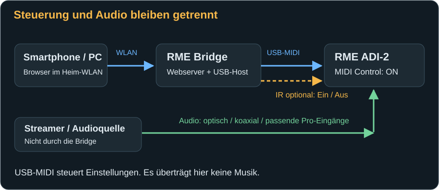

# RME Bridge: Hier beginnen

Du möchtest deinen RME-DAC vom Sofa, am Schreibtisch oder im Studio mit dem Smartphone bedienen? Die RME Bridge verbindet ein kleines ESP32-Board mit dem USB-Anschluss des DACs. Danach öffnest du eine Webseite in deinem WLAN: keine zusätzliche Smartphone-App, kein ständig laufender Computer und kein RoonPilot erforderlich.

Dieses Handbuch führt dich vom noch leeren Board bis zur täglichen Bedienung. Du brauchst weder Programmiererfahrung noch Kenntnisse der MIDI-Kommandos. Lies vor dem Anschließen die Hinweise zu den beiden USB-Buchsen und zur Versorgung des optionalen IR-Senders.

## Dein Weg zur fertigen Bridge

| Schritt | Was du machst | Woran du den Erfolg erkennst |
|---|---|---|
| 1 · Vorbereiten | [Board, Kabel und Versorgung prüfen](installation.md#was-du-benötigst). | Du weißt, welche Buchse zum Computer und welche zum DAC gehört. |
| 2 · Installieren | [Firmware auf das Board schreiben](installation.md#firmware-installieren-flashen). | Das Board startet und nennt sein Einrichtungs-WLAN. |
| 3 · Einrichten | [Bridge mit deinem WLAN verbinden](first-start.md#das-einrichtungs-wlan-öffnen). | Du erreichst die Webseite über ihre Heimnetz-IP. |
| 4 · DAC verbinden | [MIDI Control am DAC einschalten](first-start.md#den-dac-vorbereiten). | Auf der Webseite steht „DAC bereit“. |
| 5 · Bedienen | [Die Webseiten kennenlernen](web-interface.md). | Ein kleiner Lautstärkeschritt wird am DAC bestätigt. |
| 6 · Persönlich einrichten | [DAC-Einstellungen](dac-settings.md) und [Profile](profiles.md) nutzen. | Du kennst die Wirkung einer Änderung und die Grenzen eines Backups. |

Wenn etwas nicht wie erwartet funktioniert: [Fehlerbehebung](troubleshooting.md). Für eigene Automationen gibt es eine [REST-API](api.md); du kannst dieses Kapitel für die normale Bedienung überspringen.

## Was die Bridge macht – und was nicht

Die Bridge sendet Steuerbefehle über USB-MIDI und liest Antworten des DACs. MIDI transportiert hier Einstellungen, keine Musik. Die Musik muss dem DAC weiterhin über einen passenden Audioeingang zugeführt werden, beispielsweise über den optischen Eingang oder S/PDIF koaxial.

Der USB-Anschluss des DACs gehört währenddessen der Bridge. Er kann nicht zugleich mit einem Computer oder USB-Streamer verbunden sein. Die Bridge ist weder USB-Audio-Streamer noch USB-Durchleitung. Bei Pro-Geräten müssen Betriebsart und Signalweg außerdem zu deiner Verkabelung passen.

Über die Webseiten kannst du aktuelle Werte ansehen, DAC-Einstellungen verändern und die Bridge konfigurieren. Ein optionaler IR-Sender übernimmt Ein- und Ausschalten: Dafür gibt es keine entsprechende MIDI-Power-Funktion. Du brauchst keinen IR-Empfänger und musst keine Fernbedienung anlernen; die Modellcodes sind eingebaut.

Nicht Bestandteil dieser Anleitung sind Roon-Anbindung, Bluetooth-Pairing, Equalizer-Kurven, ein EQ-Preset-Editor oder das direkte Laden/Speichern der internen DAC-Setups. Die RME Bridge arbeitet hier eigenständig. Verwechsele sie nicht mit der RoonPilot IR Bridge.

## Welcher RME-DAC passt?

Die Oberfläche kennt die Familien **ADI-2 DAC**, **ADI-2 Pro** und **ADI-2/4 Pro SE**. Maßgeblich sind die tatsächliche MIDI-Antwort, die DAC-Firmware und der aktuelle Betriebsmodus – nicht allein die Beschriftung eines ausgewählten Bildes.

| Eigenschaft | ADI-2 DAC FS | ADI-2 Pro | ADI-2/4 Pro SE |
|---|---|---|---|
| Modell erkennen, gemeldete Werte darstellen | Ja | Ja | Ja |
| Modellbezogene Nicht-EQ-Einstellungen über MIDI | Die zum Modell gehörenden Einstellungen | Die zum Modell und Betriebsmodus gehörenden Einstellungen | Die zum Modell und Betriebsmodus gehörenden Einstellungen |
| Analoges Eingangsmenü | Nein, kein analoger Eingang | Ja | Ja, zusätzlich RIAA-Funktionen |
| Modellbezogene IR-Power-Codes | Ja, mit passendem Sender | Ja, mit passendem Sender | Ja, mit passendem Sender |

Die Webseiten passen ihre Optionen an das erkannte Modell an. Eine analoge Eingangsoption erscheint deshalb nicht beim ADI-2 DAC; RIAA gehört zum ADI-2/4 Pro SE. Auch Betriebsmodus, Abtastrate und aktuelle MIDI-Werte können beeinflussen, welche Einstellung gerade bedienbar ist. [Hier findest du die möglichen Ursachen für einen grauen Regler](troubleshooting.md#ein-regler-ist-grau-oder-eine-option-fehlt).

## Drei Dinge, die du dir merken solltest

1. **Bearbeitungsziel ist nicht aktiver Ausgang.** „Phones“ auswählen heißt zunächst: diesen Kanal ansehen und bearbeiten. Zum tatsächlichen Umschalten gibt es eine eigene Funktion.
2. **Ein bestätigter Wert kommt vom DAC.** Bei Verbindungsverlust wird ein alter Wert nicht als aktueller Istwert weiterverwendet. „IR gesendet“ ist dagegen nur eine Sendebestätigung.
3. **Ein Bridge-Profil ist kein vollständiges DAC-Backup.** Es enthält Modell, Bearbeitungsziel, AutoDark und einen Lautstärkewert. EQ, weitere DAC-Einstellungen und WLAN-Daten sind nicht enthalten.

## Sicher beginnen

Stelle Lautsprecher und Kopfhörer vor der ersten Änderung auf einen niedrigen Pegel. Änderungen von Quelle, Referenzpegel, DSD Direct oder Betriebsart können anders wirken als eine kleine digitale Lautstärkeänderung. Die Grenze von −60 dB bei der Phones-Auswahl ist eine Starthilfe, kein universeller Gehörschutz: Kopfhörer, Referenzpegel und Verstärkung unterscheiden sich.

Nutze die Bridge nur in einem vertrauenswürdigen lokalen Netz. Webseite und API besitzen keine Benutzeranmeldung. Eine Portfreigabe ins Internet ist deshalb ungeeignet. [Die Sicherheitsregeln stehen hier](troubleshooting.md#netzwerk-und-datenschutz).

## So liest du dieses Handbuch

Menünamen beziehen sich auf die deutsche Oberfläche; bei englischer Gerätesprache findest du die Entsprechungen im [Webseiten-Kapitel](web-interface.md#die-navigation). Ein **?** neben einer DAC-Option öffnet eine Erläuterung für das erkannte Modell. Das Handbuch nennt nur tatsächlich vorhandene Funktionen; nicht jeder DAC zeigt alle abgebildeten Optionen.

Alle Bildschirmabbildungen stammen aus der echten Oberfläche. Werte, Profilnamen und Netzwerkadressen sind Beispiele. `192.0.2.55` ist eine reine Dokumentationsadresse: Ersetze sie immer durch die IP deiner eigenen Bridge. Die dunkle Darstellung eines DAC-Displays und die Akzentfarbe der Webseite sind zwei voneinander unabhängige Einstellungen.

[Weiter: Board und Firmware vorbereiten →](installation.md)
