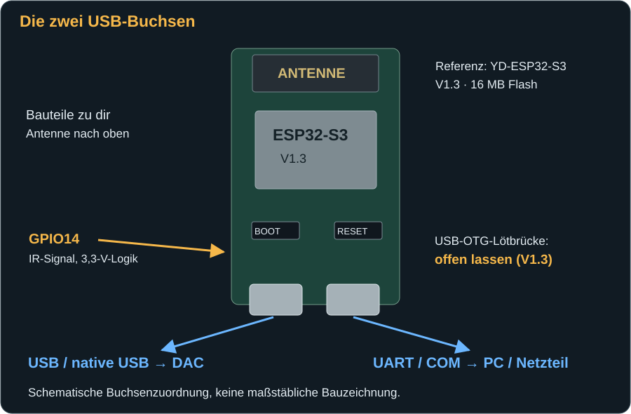
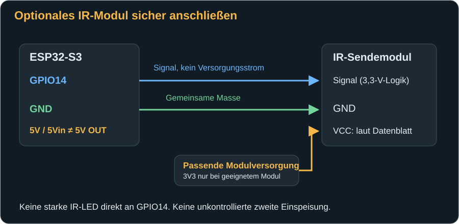

# Board, Anschlüsse und Firmware

[← Hier beginnen](index.md) · [Weiter: Erster Start →](first-start.md)

## Was du benötigst

| Teil | Darauf kommt es an |
|---|---|
| ESP32-S3-Board | Referenzaufbau: **YD-ESP32-S3 V1.3**, 16 MB Flash, mit zwei USB-C-Buchsen. Die Firmware ist für 16 MB Flash eingerichtet. Nicht mit ESP32, ESP32-C3 oder einem beliebigen S3-Board gleichsetzen. |
| Computer zur Installation | Windows, macOS oder Linux mit einem Desktop-Browser, beispielsweise Chrome oder Edge, der Web Serial unterstützt. Die spätere DAC-Bedienung funktioniert auch auf dem Smartphone. |
| USB-Datenkabel zum Computer | Passend zur **UART-/COM-Buchse** des Boards. Ein reines Ladekabel reicht nicht. |
| USB-C-auf-USB-B-Datenkabel zum DAC | Die USB-C-Seite kommt an die **native USB-Buchse** des Boards, die USB-B-Seite an den DAC. Kein USB-Hub in dieser Verbindung. |
| Stabile USB-Stromversorgung | Für den späteren Betrieb über die UART-Buchse; anfangs kann der Computer diese Versorgung übernehmen. Der DAC behält sein eigenes Netzteil. |
| WLAN | Ein erreichbares **2,4-GHz-WLAN** mit Passwort; Smartphone/Computer müssen die Bridge im selben lokalen Netz erreichen können. |
| RME-Firmwaredateien für die Bridge | Die vier zusammengehörigen Dateien des RME-Bridge-Firmwarepakets, nicht Firmware für RoonPilot oder die IR Bridge. Das Handbuch selbst enthält keine Firmware. |
| Optional: IR-Sendemodul und Leitungen | Nur für Ein/Aus per Webseite. Versorgung und 3,3-V-Logik müssen zum konkreten Modul passen. Für USB-MIDI-Einstellungen ist kein IR-Modul notwendig. |

**Flash** ist der dauerhafte Speicher des Boards. **Flashen** bedeutet, die RME-Bridge-Software dort hineinzuschreiben. Die Software heißt **Firmware**. Du musst sie nicht selbst programmieren oder einen Quellcode-Editor installieren, wenn dir die passenden Firmwaredateien vorliegen.

Lege das nackte Board auf eine trockene, nicht leitende Unterlage. Schrauben, Metallgehäuse und lose Drahtenden dürfen keine Kontakte überbrücken. Stecke GPIO-Leitungen nur bei ausgeschalteter und vom USB getrennten Bridge um.

## Die beiden USB-Buchsen nicht verwechseln

Die Zeichnung gilt für die Referenzplatine mit Antenne nach oben und Bauteilen zu dir. Auf einer anderen Revision können Buchsen, Beschriftungen und Versorgungspfade abweichen. Orientiere dich immer zusätzlich an den Beschriftungen deines Boards.

| Buchse | Aufgabe | Daran anschließen |
|---|---|---|
| **UART / COM** | Flashen, serielle Startmeldungen und Versorgung der Bridge | Während der Installation Computer; später USB-Netzteil |
| **USB / native USB / OTG** | USB-Host für die MIDI-Verbindung zum RME-DAC | RME-DAC über USB-C-auf-USB-B-Datenkabel |

Ein **USB-Host** ist die steuernde Seite der Verbindung. Im laufenden Betrieb ist die Bridge Host und der DAC USB-Gerät. Deshalb ist der native Anschluss nicht gleichzeitig ein zweiter Computeranschluss. Verwende zum Flashen ausschließlich den UART-/COM-Anschluss und lasse den DAC zunächst getrennt.

Am Referenzaufbau mit YD-ESP32-S3 V1.3 bleibt die rückseitige Lötbrücke **USB-OTG offen**. Für diesen Aufbau ist kein Löten erforderlich. Schließe keine Lötbrücke aufgrund einer Anleitung für eine andere Boardrevision. Insbesondere bedeutet „USB-OTG“ auf einer Platine nicht automatisch, dass eine Brücke für diese Firmware geschlossen werden muss.

## Den Computer vorbereiten

1. Verbinde nur die UART-/COM-Buchse mit einem USB-Datenkabel direkt am Computer. Trenne andere ESP-Boards nach Möglichkeit vorübergehend, damit du nicht das falsche auswählst.
2. Wähle im Browserdialog den **CH343-/USB-Seriell-Anschluss** dieses Boards. Eine feste COM-Nummer gibt es nicht. Falls die Zuordnung unklar ist, öffne unter Windows optional **Geräte-Manager → Anschlüsse (COM & LPT)** und beobachte, welcher Anschluss beim Einstecken erscheint. Unter macOS kann die UART-Buchse als `cu.usbserial…` oder herstellerspezifischer serieller Anschluss auftauchen.
3. Fehlt der Anschluss oder wird ein unbekanntes Gerät angezeigt, prüfe zuerst Kabel und Buchse. Der USB-Seriell-Chip der Referenzplatine ist CH343. Falls ein Treiber benötigt wird, nutze den [offiziellen WCH-Download für CH343](https://www.wch-ic.com/downloads/CH343SER_EXE.html), keine beliebigen Treiberportale. Bei anderer Bestückung ist der tatsächliche Chip maßgeblich.
4. Schließe serielle Monitore und andere Flashprogramme. Ein COM-Port kann normalerweise nur von einem Programm gleichzeitig verwendet werden.
5. Öffne den Browser außerhalb eines privaten Fensters und erlaube den Zugriff auf den von dir ausgewählten seriellen Anschluss, wenn der Browser fragt. Fehlt Web Serial, verwende einen unterstützten Desktop-Browser. Das Smartphone dient danach zur Bedienung, nicht als Voraussetzung für das Flashen.

**Wenn du schon RoonPilot oder die IR Bridge installiert hast:** Der vertraute Ablauf mit Datenkabel, Browser-Geräteauswahl, Schreiben, Prüfen und Neustart bleibt das Vorbild. Die Portregel ist hier aber anders: Der native „USB JTAG/serial debug unit“-Port ist nicht der hier verwendete UART-Anschluss. An der RME Bridge nicht den Stecker um 180 Grad drehen, um zwischen Prozessoren zu wechseln; sie hat zwei getrennte Buchsen und für diese Anleitung nur einen ESP32-S3. Keine Firmware des RoonPilot- oder IR-Bridge-Installers auf die RME Bridge schreiben.

## Firmware installieren: Flashen

Die eigenständige RME Bridge besitzt derzeit **keinen eigenen Webinstaller und kein Firmware-Upload-Menü auf ihrer Webseite**. Der folgende Weg verwendet das allgemeine [ESP Tool von Espressif](https://espressif.github.io/esptool-js/). Es läuft direkt im Browser. Es stellt aber **keine RME-Firmware** bereit: Die Dateien müssen dir separat aus einem passenden RME-Bridge-Firmwarepaket vorliegen.

### 1. Das Firmwarepaket prüfen

Entpacke das Paket in einen Ordner. Alle vier Dateien müssen zur **gleichen Version** gehören. Vermische keine Bootloader- oder Partitionstabellen anderer Projekte. Für den dokumentierten Aufbau gilt:

| Flash Address | Datei | Bedeutung |
|---|---|---|
| `0x0` | `bootloader.bin` | Startprogramm des ESP32-S3 |
| `0x8000` | `partition-table.bin` | Aufteilung des Flash-Speichers |
| `0xf000` | `ota_data_initial.bin` | Anfängliche Auswahl des Programmbereichs |
| `0x20000` | `roonpilot_rme_bridge.bin` | Die eigentliche Bridge-Firmware, einschließlich Webseiten |

Falls die Anleitung des bereitgestellten Firmwarepakets andere Adressen verlangt, nicht raten oder Dateien mischen: zuerst klären, ob Paket und Board zusammenpassen.

Die Datei `roonpilot_rme_bridge.bin` allein ist **kein komplettes Erstinstallationsabbild**. Sie gehört nicht an Adresse `0x0`. Ein ausdrücklich als vollständig zusammengefügtes Factory-Abbild geliefertes Paket wäre ein anderer Installationsweg; diese Anleitung beschreibt die vier Einzeldateien.

### 2. Den Flashmodus erreichen

1. DAC noch nicht anschließen. Board über UART am Computer lassen.
2. [ESP Tool öffnen](https://espressif.github.io/esptool-js/). Die Option **WebUSB (CH340)** nicht aktivieren; der hier beschriebene Weg verwendet den seriellen UART-Port.
3. Im Bereich **Program** als anfängliche **Baudrate** `115200` wählen. Das ist die Übertragungsgeschwindigkeit, nicht die WLAN-Geschwindigkeit.
4. **Connect** anklicken und den zuvor identifizierten seriellen Board-Anschluss auswählen. Das Werkzeug muss einen **ESP32-S3** erkennen. Wird ein anderer Chip erkannt, nicht fortfahren.
5. Falls die automatische Verbindung nicht gelingt: **BOOT** am Board gedrückt halten, **RESET** kurz drücken und loslassen, dann **BOOT** loslassen. Erneut verbinden. Falls nötig BOOT während des Verbindungsaufbaus halten und nach der Chip-Erkennung loslassen. BOOT ist keine dauerhaft zu aktivierende Einstellung.

### 3. Die Dateien schreiben

1. Nach der Verbindung erscheinen die Dateizeilen. Trage für die erste Zeile **`0x0`** ein – nicht den eventuell vorgegebenen Wert `0x1000`.
2. Wähle `bootloader.bin`. Mit **Add File** drei weitere Zeilen ergänzen und Adressen sowie Dateien genau nach der Tabelle zuordnen.
3. **Flash Mode: dio** verwenden. **Flash Frequency: keep** belässt die zum Paket gehörende Frequenz; das dokumentierte Paket verwendet 80 MHz. **Flash Size: detect** muss zum 16-MB-Board passen; keine kleinere Kapazität erzwingen.
4. Bei einem neuen, leeren Board ist kein vorsorgliches **Erase Flash** nötig. Bei einem absichtlichen Wechsel von anderer Firmware oder einem vollständigen Zurücksetzen kann es nötig sein, vorher zu löschen. **Erase Flash löscht alle Bridge-Einstellungen, Profile und das Einrichtungs-Passwort.** Nur bewusst benutzen; auf einem bereits eingerichteten Gerät vorher Profile exportieren und Netzwerkeinstellungen notieren.
5. **Program** anklicken. Während des Schreibens Kabel, Board und Browsertab in Ruhe lassen. Den Abschluss aller Dateien und einen eventuellen Fehlertext prüfen. Nicht bereits nach dem ersten 100-%-Balken trennen.
6. **Disconnect** wählen. Falls die Firmware nicht automatisch startet, **RESET** einmal kurz drücken, ohne BOOT festzuhalten.

Allgemeine Hinweise zu Verbindungsproblemen findest du zusätzlich in der [Espressif-Fehlerhilfe](https://docs.espressif.com/projects/esptool/en/latest/esp32s3/troubleshooting.html).

### 4. Das Einrichtungs-Passwort ablesen

Die Bridge erzeugt beim ersten Start ein eigenes, zufälliges **16-stelliges Passwort** für ihr Einrichtungs-WLAN. Es gibt kein gemeinsames Standardpasswort.

1. Im ESP Tool muss **Program** bereits getrennt sein.
2. Im Bereich **Console** `115200` Baud wählen, **Start** anklicken und denselben UART-Anschluss auswählen.
3. **RESET** am Board einmal kurz drücken. Die Startmeldungen erscheinen in der Konsole.
4. Suche die Zeile `First setup: connect to RME-Bridge-… with password …`. Notiere WLAN-Name und Passwort **privat**. In dieser Zeile ist das echte Passwort enthalten; sie gehört nicht in öffentliche Screenshots oder Support-Posts.
5. **Stop** beendet die Konsole und gibt den Port wieder frei. Das Board kann am Computer bleiben, bis die WLAN-Einrichtung abgeschlossen ist.

Wenn die Bridge schon mit einem WLAN eingerichtet wurde, erscheint die Erststartzeile möglicherweise nicht erneut. Das Passwort wird dauerhaft auf der Bridge gespeichert, ist aber nicht auf der Netzwerk-Statusseite abrufbar. Bewahre es daher schon beim ersten Start auf. [Was bei Verlust möglich ist](troubleshooting.md#das-einrichtungs-passwort-ist-verloren).

## Optionalen IR-Sender anschließen

USB-MIDI funktioniert ohne diesen Schritt. IR wird nur benötigt, wenn du den DAC über die Webseite einschalten oder in Standby schicken möchtest. Die Firmware steuert das Signal an **GPIO14**, nicht GPIO4. Es sind bekannte, modellbezogene Power-Codes integriert; es gibt keine Lernfunktion.

| Verbindung | Anschluss am Referenzboard | Wichtig |
|---|---|---|
| Steuersignal | Pin mit Aufdruck **14**, links unten bei Antenne nach oben | 3,3-V-Logiksignal; kein Versorgungsanschluss |
| Masse / GND | Pin mit Aufdruck **G** / GND | Muss mit der Masse des Sendemoduls verbunden sein |
| Modulversorgung | **3V3 nur bei einem dafür spezifizierten Modul** | Versorgungsspannung und Stromaufnahme des konkreten Moduls prüfen |
| Pin **5V / 5Vin** | Nicht pauschal als Sender-Versorgung verwenden | Bei diesem Aufbau kein zugesicherter 5-V-Ausgang |

Die Anordnung von Signal, Plus und Minus unterscheidet sich zwischen Modulen. Bezeichnungen wie `S`, `+`, `−` oder auch nur die Kabelfarben reichen nicht für eine universelle Belegung. Folge dem Datenblatt deines Sendemoduls. Ein 5-V-Modul, das bei 3,3 V sichtbar funktioniert, ist deshalb noch nicht automatisch für diese Versorgung spezifiziert.

Benötigt dein Modul 5 V, ist eine passende, fachgerecht ausgeführte Versorgung nötig. Keine zweite Spannungsquelle einfach an `5Vin` oder USB anschließen: Das kann Strom in einen Computer oder ein Netzteil zurückspeisen. GPIO14 darf nicht mit einem 5-V-Signal verbunden werden. Verwende ein Sendemodul mit geeigneter Treiberstufe; eine leistungsstarke IR-LED nicht direkt am GPIO betreiben.

Montiere den Sender so, dass er zum IR-Empfänger des DACs zeigt. Die Antenne des ESP32 sollte nicht von Metall oder einem Kabelbündel verdeckt werden. Für die Verbindung an den unteren Pins lassen sich die Leitungen seitlich nach unten führen. Ein kurzes USB-Steckergehäuse erleichtert den Einbau.

## Aktualisieren oder von vorn beginnen?

Eine Firmwareaktualisierung und ein Werksreset sind nicht dasselbe. Verwende für ein Update die Anweisungen des passenden Pakets. Das Schreiben eines kompatiblen Pakets **ohne vollständiges Löschen** ist nicht dazu gedacht, gespeicherte Einstellungen zu entfernen; einen Erhalt über jede Firmwareänderung hinweg solltest du trotzdem nicht voraussetzen. Exportiere Profile vorher und halte WLAN-Zugang sowie AP-Passwort bereit.

Die aktuelle Bridge-Webseite bietet weder OTA-Upload noch einen Werksreset-Knopf. Ein absichtlicher kompletter Neustart der Einrichtung erfolgt über **Erase Flash** und anschließende vollständige Neuinstallation. Dadurch entsteht beim nächsten ersten Start ein neues AP-Passwort; Profile sind ohne vorheriges Backup verloren. Verwende diesen Weg nicht als erste Maßnahme bei einer fehlenden DAC-Antwort.

[Weiter: WLAN einrichten und den DAC verbinden →](first-start.md)
