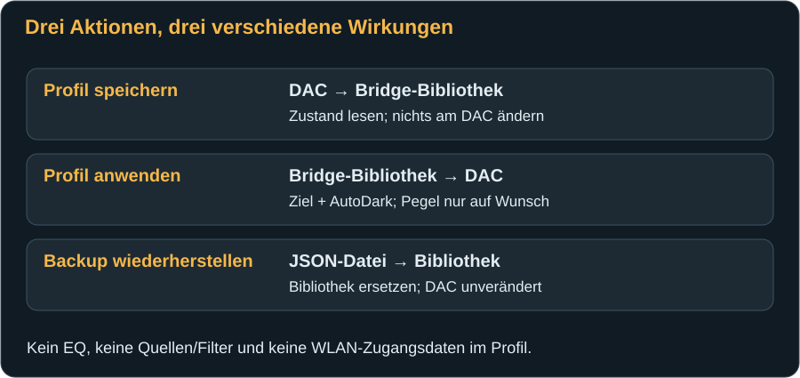
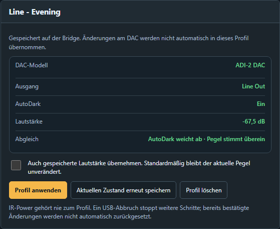
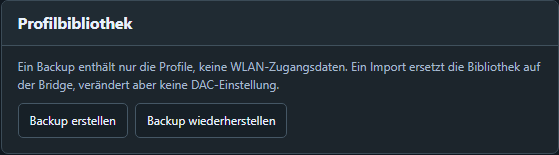

# Profile speichern und sichern

[← DAC-Einstellungen](dac-settings.md) · [Weiter: Fehlerbehebung →](troubleshooting.md)

Ein **Bridge-Profil** ist eine benannte Momentaufnahme bestimmter, bestätigter DAC-Werte. Es wird dauerhaft auf der Bridge gespeichert. Das ist praktisch für etwa „Abendhören“ und „Kopfhörer leise“, aber kein vollständiges RME-Setup und keine laufend aktualisierte Kopie des DACs.

## Was ein Profil enthält

| Enthalten | Nicht enthalten |
|---|---|
| Profilname und ID | Musik, Abspiellisten oder Wiedergabezustand |
| DAC-Modellkennung | Firmware des DACs oder der Bridge |
| Bearbeitungsziel: Line Out, Phones oder IEM | Physische Ausgangsumschaltung oder IR-Power |
| AutoDark | Quelle, Referenzpegel, Loudness, Crossfeed und andere zusätzliche DAC-Parameter |
| Lautstärke dieses einen Ausgangs | EQ-Kurven, EQ-Presets und interne RME-Setups |
| | WLAN-Daten, Bridge-Sprache und Website-Akzentfarbe |

Maximal **acht Profile** sind möglich. In dieser Firmware ist das Erfassen und Anwenden von Profilen für den passenden, per MIDI erkannten **ADI-2 DAC FS** verfügbar, nicht für die Pro-Familien. Das Backup der Profilbibliothek ist entsprechend kein Austauschformat für alle DAC-Modelle oder für RoonPilot.

## Ein neues Profil anlegen

1. Stelle am DAC bzw. auf der Bridge den gewünschten AutoDark-Zustand und eine sichere Lautstärke ein.
2. Wähle das richtige **Bearbeitungsziel** auf DAC-Steuerung. Warte beim Wechsel zu Phones, bis eine eventuell notwendige Absenkung abgeschlossen ist.
3. Öffne **Profile**. Im Bereich **Neues Profil** müssen Modell, Ausgang und bestätigter Pegel zu deiner Absicht passen.
4. Gib einen eindeutigen Namen ein, beispielsweise **Abendhören**. Namen dürfen höchstens 48 UTF-8-Bytes umfassen; Umlaute und Emoji benötigen mehr als ein Byte. Mit kurzen Namen bleibst du problemlos darunter. Keine Leerzeichen am Anfang/Ende und keine mehrfach gleichen Namen verwenden.
5. Drücke **Profil speichern**. Das Profil erscheint in **Gespeicherte Profile**. Der DAC wird dadurch nicht verändert.

Der Moment zählt: Spätere Änderungen am DAC oder in einem anderen Browser aktualisieren das gespeicherte Profil **nicht automatisch**.

## Ein Profil ansehen und vergleichen

Wähle ein Profil in der Liste. Die Vorschau zeigt gespeichertes Modell, Bearbeitungsziel, AutoDark und Pegel. **Abgleich** sagt, welche Werte zum aktuellen DAC passen oder abweichen. Das bloße Auswählen in der Liste sendet keinen DAC-Befehl und schaltet kein Ausgangsziel um.

Der Vergleich kann „Pegel weicht ab“ anzeigen, obwohl du gleich ohne Lautstärkeübernahme anwenden möchtest. Das ist keine Fehlermeldung: Die gespeicherte Lautstärke ist bewusst eine optionale Information.

## Ein Profil anwenden

1. Prüfe Modell und Zielausgang in der Vorschau. Der passende DAC muss online sein und aktuelle Werte liefern.
2. Entscheide, ob **„Auch gespeicherte Lautstärke übernehmen“** aktiviert werden soll. Standardmäßig ist das Feld **aus** und wird bei der Wahl eines Profils wieder ausgeschaltet.
3. Drücke **Profil anwenden** einmal. Die Seite zeigt Fortschritt, den laufenden Schritt und bestätigte Pegel.
4. Warte auf **„Profil vollständig angewendet“** und prüfe den resultierenden Zustand.

Ohne Lautstärkeübernahme wird AutoDark angeglichen und das Bearbeitungsziel ausgewählt. **Ausnahme:** Muss das Ziel zu Phones wechseln, bleibt die Sicherheitsabsenkung auf höchstens −60 dB aktiv. Deshalb bedeutet „Lautstärke nicht übernehmen“ nicht, dass ein solcher Phones-Wechsel niemals den Pegel reduziert.

Mit Lautstärkeübernahme führt die Seite den DAC in bestätigten Teilschritten zum gespeicherten Wert. Bei einem neuen Wechsel zu Phones wird ein gespeicherter lauterer Wert nicht wieder oberhalb der Auswahlgrenze oder über den dabei bereits leiseren Pegel angehoben. Bei einem bereits gewählten Ziel ohne Zielwechsel gelten die normalen Profilwerte; dies ist keine dauerhaft globale Phones-Obergrenze.

**Beispiel:** Du hörst Line Out. Das gewählte Phones-Profil enthält −40 dB. Beim Zielwechsel wird der aktuelle Phones-Pegel bei Bedarf abgesenkt. Das Profil springt danach nicht auf −40 dB zurück. Enthält es −71 dB, kann es beim Anwenden mit Pegelübernahme entsprechend leiser werden.

Das Anwenden schaltet den physischen Ausgang **nicht** über die Toggle-Funktion um und sendet **keinen** Power-Code. Ein Profil kann daher einen nicht gehörten Kanal bearbeiten; prüfe bei Bedarf die getrennte aktive Ausgangsanzeige.

## Stoppen und nach einem Abbruch fortfahren

**Weitere Schritte stoppen** stoppt die nächste Folge, nachdem ein gerade laufender DAC-Befehl noch bestätigt wurde. Es ist kein Rückgängig-Knopf. Bereits bestätigte Änderungen bleiben bestehen.

USB-Abbruch, ein anderer DAC, externe Pegeländerung oder ausbleibende Bestätigung können den Ablauf unterbrechen. Schließe den DAC wieder an, lies seinen Zustand neu und prüfe, welche Werte bereits passen. Wiederhole nicht blind eine große Pegeländerung. Nach der Prüfung kannst du dasselbe Profil erneut anwenden; die Seite startet mit aktuellen Werten, nicht mit einem ungeprüften alten Stand.

## Vorhandenes Profil aktualisieren oder löschen

**Aktuellen Zustand erneut speichern** ersetzt die Momentaufnahme des ausgewählten Profils durch den aktuellen Zustand und fragt vor dem Ersetzen nach. Prüfe zuvor das aktuelle Bearbeitungsziel; dieser Knopf kann die Profilwerte neu erfassen, statt das Profil am DAC anzuwenden.

**Profil löschen** entfernt nach Bestätigung genau den gewählten Eintrag von der Bridge. Das ändert weder die derzeitige Lautstärke noch AutoDark des DACs. Zum Bewahren erst ein Backup herunterladen.

## Backup erstellen

1. Öffne **Profile → Profilbibliothek**.
2. Drücke **Backup erstellen** und speichere die heruntergeladene JSON-Datei an einem sinnvollen Ort.
3. Behalte den Inhalt unverändert. JSON ist das strukturierte Dateiformat des Backups; du musst es nicht von Hand bearbeiten.

Das Backup liest die gespeicherte Bibliothek der Bridge. Der DAC muss dafür nicht online sein. Es enthält alle vorhandenen Profile, aber nur die in der Tabelle genannten Felder. Speichere bei wichtigen Änderungen eine neue Datei und behalte gegebenenfalls die vorherige Version. Prüfe, dass der Browser tatsächlich einen Download gespeichert hat.

Für die **vollständige DAC-Konfiguration** einschließlich EQ nutze die Sicherungsfunktion der RME-Remote-Software nach deren Handbuch. Deren Setup-Dateien sind kein Bridge-Profilbackup und können hier nicht importiert werden.

## Backup wiederherstellen

1. Falls sich die vorhandene Bridge-Bibliothek geändert hat, sichere sie zuerst separat.
2. **Backup wiederherstellen** wählen und die unveränderte Bridge-JSON-Datei auswählen.
3. Den Hinweis zum **Ersetzen der gesamten Bibliothek** lesen und bestätigen. Es ist kein Zusammenführen einzelner Profile.
4. Warten, bis die importierten Profile in der Liste stehen.

Ein Import prüft Format, Modell, Werte und eindeutige Namen, bevor die Bibliothek ersetzt wird. Ein gültiges **leeres Backup** entfernt alle Profile. Ein importiertes Backup ändert weder WLAN noch DAC-Zustand. Erst das anschließende bewusste **Profil anwenden** sendet DAC-Befehle.

## Was bei Stromverlust erhalten bleibt

Gespeicherte Profile sowie die erfolgreich gespeicherten WLAN-/Bridge-Einstellungen liegen im dauerhaften Flash-Speicher. Sie bleiben nach einem normalen Stromwechsel erhalten. Noch nicht abgeschlossene Speichervorgänge darfst du nicht durch Abziehen unterbrechen. Ein vollständiges **Erase Flash** entfernt die Bibliothek und Einstellungen; das Ereignislog ist außerdem unabhängig davon nicht als dauerhaftes Archiv ausgelegt.

[Weiter: Probleme systematisch eingrenzen →](troubleshooting.md)
