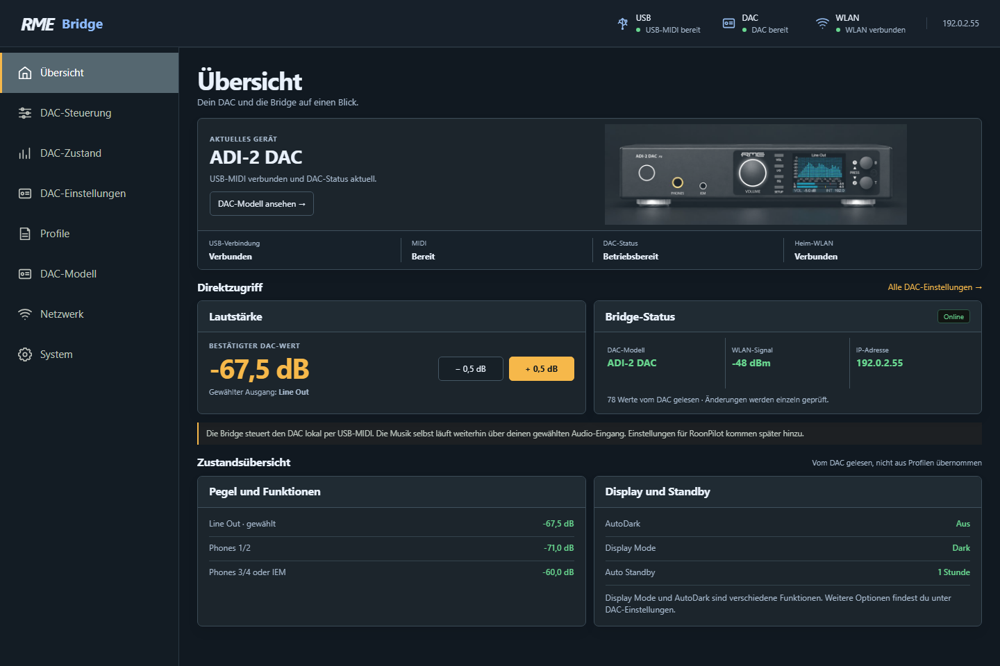
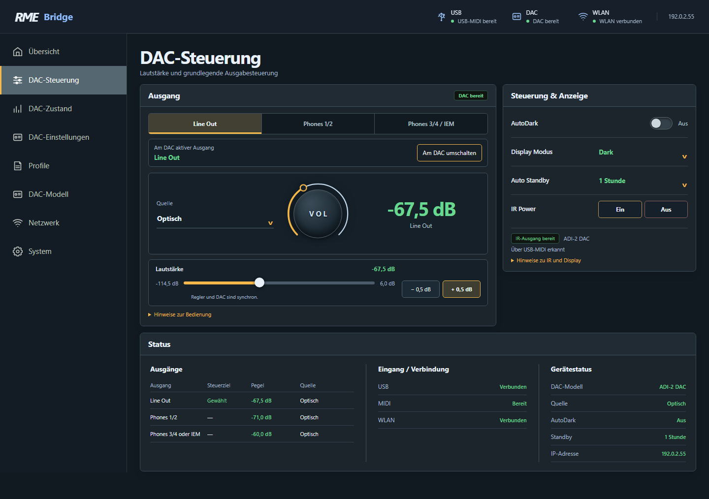
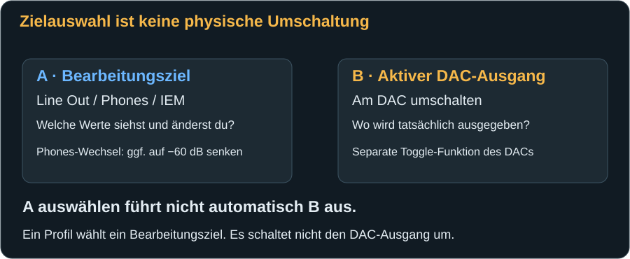
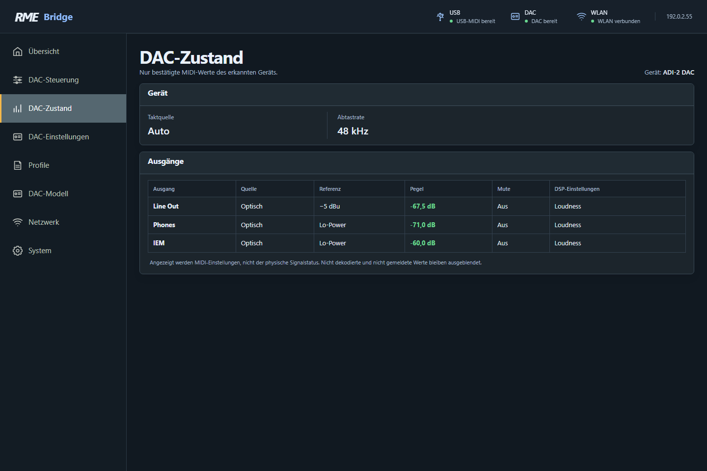
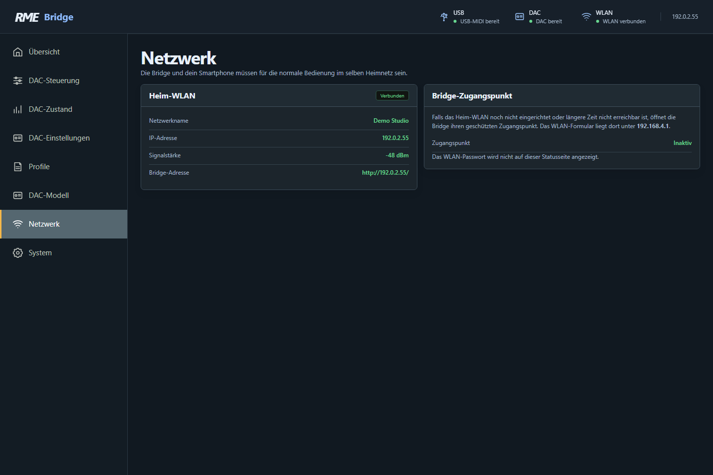
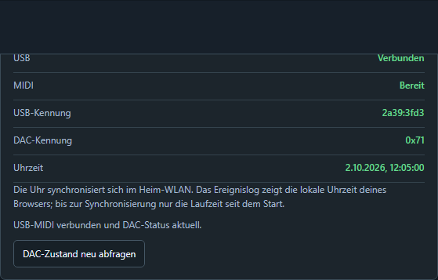
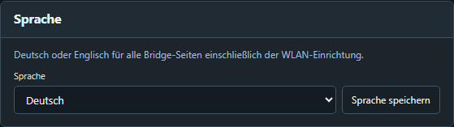
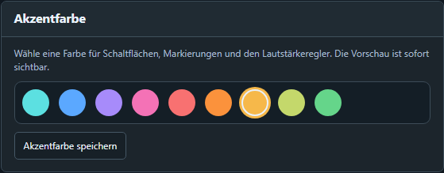
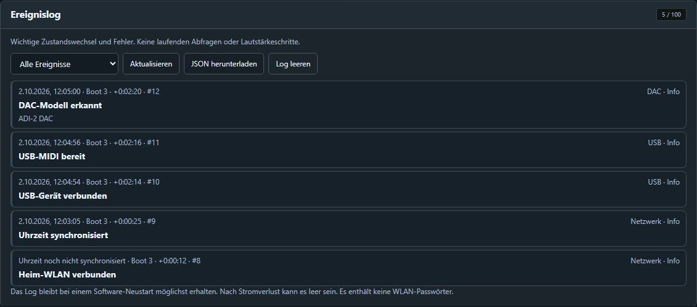
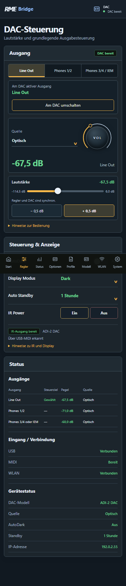

# Die Webseiten im Detail

[← Erster Start](first-start.md) · [Weiter: DAC-Einstellungen →](dac-settings.md)

Öffne die Heimnetz-IP deiner Bridge im Browser. Die Seite wird von der Bridge selbst geliefert. Der DAC benötigt keinen eigenen WLAN-Anschluss; die Bridge verbindet WLAN-Bedienung mit USB-MIDI.

## Die Navigation

Am Computer stehen die Seiten links im Menü. Auf dem Smartphone befindet sich eine kompakte Navigation am unteren Rand. Sie verwendet kürzere Namen, bietet aber dieselben Bereiche. Ein Menüwechsel verändert keine DAC-Einstellung.

| Deutsch am Computer | English | Mobil, Deutsch | Inhalt |
|---|---|---|---|
| Übersicht | Overview | Start | Gerät, Verbindung, Pegel und Direktzugriff |
| DAC-Steuerung | DAC control | Regler | Lautstärke, Bearbeitungsziel, Umschaltung, AutoDark, IR-Power |
| DAC-Zustand | DAC state | Status | Lesende, modellbezogene Zustandsübersicht |
| DAC-Einstellungen | DAC settings | Optionen | Ausgang, Eingang, Gerät und Anzeige |
| Profile | Profiles | Profile | Momentaufnahmen speichern, vergleichen, anwenden und sichern |
| DAC-Modell | DAC model | Modell | Automatik, Suchpräferenz und IR-Modell |
| Netzwerk | Network | WLAN | Heimnetz und Einrichtungszugang |
| System | System | System | Diagnose, Sprache, Akzentfarbe und Ereignislog |

Die Statuszeile oben zeigt **USB**, **DAC**, **WLAN** und am größeren Bildschirm die IP. Grün bedeutet dort eine verfügbare Verbindung; eine Warnung zeigt beispielsweise ein erkanntes USB-Gerät ohne nutzbares MIDI. Auf schmalen Displays ist nicht jedes Statusfeld sichtbar – die vollständigen Informationen stehen auf Übersicht und System.

Eine Einstellung wirkt meist sofort nach deiner Bedienung. Gewöhnliche DAC-Befehle haben **keinen zusätzlichen Bestätigungsdialog**. „Vom DAC bestätigt“ bezeichnet das anschließende technische Zurücklesen, nicht eine zweite Frage an dich. Für das Löschen oder Ersetzen gespeicherter Daten bleiben Bestätigungen bestehen.

## Übersicht

**Aktuelles Gerät** zeigt das durch MIDI identifizierte Modell und dessen Bild. Darunter stehen USB, MIDI, DAC und Heim-WLAN getrennt. So lässt sich unterscheiden, ob nur die WLAN-Verbindung funktioniert oder auch der DAC antwortet.

Der Lautstärkebereich zeigt den bestätigten Wert des ausgewählten Bearbeitungsziels und bietet **±0,5 dB** als Direktzugriff. Im **Bridge-Status** findest du Modell, WLAN-Signal, IP und den Stand der gelesenen DAC-Werte. Die Anzahl gelesener Werte ist keine Prozentanzeige und bei verschiedenen Modellen unterschiedlich.

**Pegel und Funktionen** fasst die gemeldeten Ausgänge zusammen. **Display und Standby** zeigt AutoDark, Display Mode und Auto Standby. Für reine Beobachtung ist diese Seite ein guter Ausgangspunkt; die Lautstärketasten sind allerdings echte Bedienung.

## DAC-Steuerung

### Welchen Ausgang bearbeitest du?

Die drei oberen Felder **Line Out**, **Phones 1/2**, **Phones 3/4 / IEM** wählen das **Steuer- bzw. Bearbeitungsziel**. Der ADI-2 DAC hat tatsächlich **Line Out**, **Phones** und **IEM**. Bei Pro-Modellen entsprechen die Kopfhörerpfade Phones 1/2 und Phones 3/4; sie können abhängig vom Gerätemodus miteinander verknüpft sein.

Die Auswahl gilt auch auf der Einstellungsseite. Du kannst damit beispielsweise IEM-Einstellungen bearbeiten, obwohl du gerade Line Out hörst. Sie schaltet nicht allein den physischen Ausgang um.

Bei einem **Wechsel** auf ein Phones-Ziel liest die Webseite dessen bestätigten Pegel. Ist er lauter als **−60 dB**, senkt sie ihn in bestätigten Schritten auf −60 dB ab. Liegt er schon darunter, bleibt er unverändert. Diese Absenkung ist eine echte Änderung am gewählten Kopfhörerpfad, auch wenn dieser nicht gerade hörbar ist. Ein unbekannter Pegel oder eine nicht freigegebene Absenkung verhindert den Abschluss der Auswahl. Es handelt sich nicht um eine dauerhafte Lautstärkeobergrenze: Nach der Auswahl kannst du einen freigegebenen Regler bewusst wieder höher stellen.

### Den aktiven DAC-Ausgang wirklich umschalten

Der separate Bereich **„Am DAC aktiver Ausgang“** zeigt den vom DAC gemeldeten aktiven Ausgang. **„Am DAC umschalten“** ist eine andere Aktion als die drei Bearbeitungsziele.

Für den freigegebenen ADI-2 DAC FS:

1. Unter **DAC-Einstellungen → Gerät → Kopfhörer → Line Out stumm bei Kopfhörer** muss **Umschalten** oder **Eingesteckt** eingestellt sein. Am DAC heißen die Optionen **Toggle Ph/Line** beziehungsweise **Toggle plugged**; du kannst sie auch dort einstellen.
2. Beide Kopfhörerpfade, Phones und IEM, müssen einen bekannten, bestätigten Pegel von **höchstens −60 dB** haben. Wähle bei Bedarf nacheinander beide als Bearbeitungsziel und warte auf ihre Absenkung. Bei −71 dB ist bereits alles leise genug; −40 dB wäre zu laut für die Freigabe.
3. Drücke **Am DAC umschalten** einmal. Der DAC wechselt nach seiner eigenen Toggle-Konfiguration. Welche Buchsen berücksichtigt werden, kann auch von eingesteckten Kopfhörern abhängen.
4. Warte auf die Bestätigung des neuen aktiven Ausgangs. Danach folgt das Bearbeitungsziel diesem Ausgang. Prüfe beide Anzeigen; erst dann weiter regeln.

Die Meldung neben einem gesperrten Schalter erklärt fehlende Pegel, eine ungeeignete Toggle-Einstellung oder fehlende Modellfreigabe. Bei Pro-Geräten stehen deren gerätebezogene Kopfhöreroptionen im Einstellungsbereich; dieser einzelne Umschaltknopf ist dort nicht freigegeben. Wenn ein Umschaltauftrag unbestätigt bleibt, nicht mehrfach blind klicken: Der DAC könnte bereits umgeschaltet haben.

### Lautstärke und die beiden Zahlen

Die **große dB-Zahl** ist der vom DAC bestätigte Istwert. Der Wert **beim Slider** zeigt während einer Bewegung deinen Zielwert. Der runde **VOL**-Ring ist hier eine grafische Pegelanzeige, kein zusätzlicher interaktiver Drehregler. Bediene die Lautstärke mit Slider oder ±0,5-dB-Tasten. Die drei Drehregler im Loudness-Bereich sind dagegen interaktiv.

Ziehe den Slider langsam oder schnell. Die Webseite zeigt den Zielwert unmittelbar und führt den DAC in bestätigten Teilschritten nach. Währenddessen kann der Istwert kurz vom Zielwert abweichen. Die Einzelbefehle erhöhen höchstens um 1 dB oder senken höchstens um 3 dB; die Webseite zerlegt einen größeren Weg automatisch. Normale Lautstärkeschritte erzeugen keine Erfolgsmeldung rechts unten und keine Log-Flut.

Nicht gleichzeitig in einem zweiten Browser oder am DAC-Knopf gegenregeln. Ein anderer gemeldeter Wert oder Verbindungsverlust kann die laufende Folge stoppen. Aus- und Einschalten des DACs führt nicht zum automatischen Nachsenden eines alten Lautstärkeziels.

### Quelle, Display und Standby

Die angezeigte **Quelle** gehört zum Bearbeitungsziel. Ein Klick öffnet die zugehörigen Ausgangseinstellungen; er schaltet nicht schon beim Öffnen einen Eingang um. **Display Modus** und **Auto Standby** führen ebenfalls direkt in den richtigen Einstellungsbereich.

**AutoDark** ist ein sofort wirkender Schalter: Aus hält die DAC-Anzeige sichtbar, Ein lässt sie nach Inaktivität ausgehen. Die Musik läuft weiter. Der dunkle **Display Mode** ändert dagegen die Gestaltung des DAC-Displays. **Auto Standby** ist eine echte automatische Abschaltfunktion des DACs; diese drei Dinge sind nicht austauschbar.

### Ein- und Ausschalten per IR

**IR Power → Ein / Aus** sendet den eingebauten Power-Code für das bekannte DAC-Modell. Ein/Aus steuert den DAC, nicht die Bridge. Der Sender muss [korrekt angeschlossen](installation.md#optionalen-ir-sender-anschließen) und auf den DAC ausgerichtet sein.

Die Herkunft des IR-Modells steht unter den Tasten: aktueller USB-MIDI-Nachweis, manuelle Modellpräferenz oder zuletzt erkanntes Modell. Bei verbundenem DAC hat seine bestätigte Identität Vorrang. Ohne bekanntes Modell bleiben die IR-Tasten gesperrt. Mit zuvor erkanntem oder manuell passendem Modell kann **Ein** auch bei ausgeschaltetem DAC verfügbar sein.

„IR-Ausgang bereit“ zeigt die Verfügbarkeit der Signal-Ausgabe in der Bridge. Es erkennt **nicht**, ob tatsächlich ein Modul eingesteckt ist oder der DAC freie Sicht hat. Ein grüner Senderstatus ist daher kein Reichweitentest. Eine Sendebestätigung beweist nur, dass der IR-Befehl ausgegeben wurde. Erst die spätere MIDI-Antwort belegt einen wieder erreichbaren DAC; fehlendes MIDI allein beweist umgekehrt nicht sicher, dass er ausgeschaltet ist.

Der Ausschaltcode ist ein eigener, modellbezogener Befehl. Du musst die Aus-Taste der Webseite nicht lange halten, auch wenn die Originalfernbedienung Ausschalten über langen Druck auf Power auslöst. Es werden weder Musikwiedergabe noch Verstärkerzustand vor dem Ausschalten geprüft. Ein wiederholtes **Ein** ist kein Toggle-Befehl zum Ausschalten.

### Status unter den Reglern

Hier siehst du gemeldete Pegel und Quellen der Ausgänge, USB/MIDI/WLAN und grundlegende Geräteeinstellungen. „Gewählt“ meint das Bearbeitungsziel – nicht „hier liegt gerade hörbares Audio an“. Für den detaillierteren lesenden Blick öffne **DAC-Zustand**.

## DAC-Zustand: Die SOV-nahe Ansicht

Diese Seite orientiert sich an der Zustandsübersicht der RME-Software, ist aber kein pixelgenauer Nachbau. Sie ist **rein lesend**. Angezeigt werden nur Werte, die über MIDI tatsächlich vorliegen und für das erkannte Modell verständlich dekodiert sind.

**Gerät** zeigt beispielsweise Taktquelle und Abtastrate; Pro-Geräte zusätzlich den gemeldeten Grundmodus. **Ausgänge** enthält Quelle, Referenzpegel, Lautstärke, Mute und vorhandene DSP-Schalter. „EQ“, „B/T“, „Loudness“ oder „Crossfeed“ sind Einstellungen, kein Echtzeitnachweis ihrer Wirkung bei jeder Abtastrate. EQ-Werte werden damit nicht bearbeitbar.

Es gibt hier keine erfundenen Anzeigen für Bit-Tiefe, digitalen Sync oder einen allgemeinen „Output On“-Status. Nicht gelieferte Werte bleiben leer oder ausgeblendet. Bei einem DAC-Ausfall verschwinden Live-Werte, statt eine alte Kopie als aktuell auszugeben. Die Browseransicht ersetzt keinen Echtzeit-Audioanalyzer.

## DAC-Einstellungen

Ausgang wählen, dann **Ausgang / Eingang / Gerät / Anzeige** öffnen. Schalter, Tastenfelder, Listen, Slider und Loudness-Drehregler bedienen die betreffende Option unmittelbar. **?** öffnet die modellbezogene Hilfe; ein erneuter Klick, außerhalb klicken, **×** oder Escape schließt sie.

Ein Eingangsmenü ist nur sinnvoll bei einem DAC mit analogem Eingang. Das ADI-2 DAC zeigt deshalb keine Pro-Eingangsfunktionen. Fehlende oder unzulässige Optionen werden nicht als angeblich einstellbare Werte dargestellt. [Alle Bereiche und die komplexeren Funktionen erklärt das nächste Kapitel](dac-settings.md).

## Profile

Hier kannst du bis zu acht benannte Momentaufnahmen verwalten. **Speichern** liest einen aktuellen Zustand und schreibt ihn auf die Bridge, nicht zurück zum DAC. **Anwenden** ist dagegen ein tatsächlicher Vorgang am DAC. **Backup wiederherstellen** ersetzt nur die Profilbibliothek und wendet kein Profil automatisch an.

Die Profilvorschau hilft, Unterschiede zu erkennen. Die Lautstärkeübernahme ist standardmäßig aus; dennoch kann ein nötiger Wechsel des Bearbeitungsziels zu Phones dessen Sicherheitsabsenkung auslösen. [Schrittfolgen und alle Backup-Grenzen stehen im Profilkapitel](profiles.md).

## DAC-Modell

Die automatische Erkennung fragt die drei RME-Familien nacheinander an. **Automatisch** ist die normale Wahl. Die tatsächliche Antwort entscheidet über Namen, Befehle und dargestellte Werte.

Eine manuelle Modellwahl speichert eine **Such- und IR-Präferenz**. Bei der nächsten USB-Erkennung wird dieses Modell zuerst geprüft. Sie verwandelt kein Gerät in einen anderen DAC, ersetzt keine MIDI-Verbindung und aktiviert keine gesperrten Regler. Bei einem bereits verbundenen Gerät wirkt die Suchreihenfolge erst nach erneuter USB-Erkennung.

Für IR-Einschalten ohne vorherige Erkennung kannst du das **wirklich vorhandene** Modell manuell wählen. Für einen verbundenen DAC überschreibt die erkannte Identität diese Präferenz bei der Befehlswahl. Eine Abweichung wird angezeigt.

## Netzwerk

**Heim-WLAN** nennt Netzwerk, IP, Signalstärke in dBm und den Bridge-Hostnamen. Bei negativen dBm-Werten ist eine näher an null liegende Zahl das stärkere Signal. Diese Zahl ist kein Datendurchsatz und keine Garantie der Antwortzeit.

Der **Bridge-Zugangspunkt** zeigt, ob das geschützte Einrichtungs-WLAN aktiv ist. Nur dort steht die WLAN-Konfiguration zur Verfügung. Folge für die Änderung von Zugangsdaten [dem Einrichtungsablauf](first-start.md#wenn-du-das-wlan-später-ändern-möchtest). Weder Heimnetz-Passwort noch AP-Passwort werden hier angezeigt. Der Hostname ist zur Zuordnung etwa im Router nützlich; verwende für den sicheren Einstieg die angezeigte IP und setze keine `.local`-Auflösung voraus.

## System

### Verbindung und Uhrzeit

USB-Kennung und DAC-Kennung helfen, das angeschlossene Gerät zu identifizieren. **DAC-Zustand neu abfragen** löst eine neue Statusabfrage aus, keinen Neustart und keine Rücksetzung.

Die Bridge holt die Uhrzeit automatisch über SNTP, sobald sie im Heim-WLAN eine IP hat und den Zeitserver erreichen kann. Das Log stellt Datum und Zeit in der **Zeitzone des Browsers** dar; Sommer-/Winterzeit folgt damit dessen Zeitzoneneinstellung. Es gibt keine separate manuelle Uhr- oder Zeitzonenwahl auf der Bridge. Vor der Synchronisierung ist die Uhrzeit ausdrücklich unbekannt; Boot und Laufzeit bleiben aussagekräftig.

### Sprache und Akzentfarbe

**Sprache speichern** speichert Deutsch oder Englisch auf der Bridge, einschließlich Einrichtungsseite. Diese Wahl verändert nicht die Sprache des RME-DACs und gilt nicht nur für einen einzelnen Browser.

Die neun Akzentfarben sind Türkis, Blau, Violett, Magenta, Rot, Orange, Bernstein, Limette und Grün. Ein Klick zeigt sofort eine Vorschau. Erst **Akzentfarbe speichern** macht sie dauerhaft. Die Farbe betrifft die Bridge-Webseite einschließlich Setup, nicht die Meter-Farbe am DAC. Blau ist die Voreinstellung.

### Ereignislog

Das Log enthält wichtige Starts, WLAN- und USB-Wechsel, DAC-Erkennung, Fehler bei Befehlen, IR-Sendungen und Änderungen gespeicherter Bridge-Daten. Gewöhnliche Statusabfragen und Lautstärkeschritte werden nicht aufgenommen. **Nur Probleme** blendet Info-Ereignisse aus; für eine Rekonstruktion hilft oft **Alle Ereignisse**.

**Aktualisieren** liest das Log erneut. **JSON herunterladen** speichert die gelesenen Ereignisse als Datei für Diagnose oder Support. **Log leeren** entfernt nach Bestätigung die gespeicherten Ereignisse; es ist keine Rücksetzung der Konfiguration.

Es passen **100 Einträge** in den Ringspeicher: Bei weiteren Ereignissen werden die ältesten ersetzt. Gleiche Ereignisse können zusammengefasst und mit einer Wiederholungszahl angezeigt werden. Der Speicher übersteht Software-Neustarts nach Möglichkeit, ist aber kein dauerhaftes Archiv. Nach Stromverlust kann das Log leer sein. Lade wichtige Ereignisse daher vor dem Ausschalten herunter.

Datum/Uhrzeit, **Boot**, **+Laufzeit** und **#Sequenz** helfen bei der Einordnung. Boot bezeichnet eine Startsitzung, die Laufzeit zählt seit diesem Start und die Sequenz ordnet Ereignisse im Log. Ereignisse vor der ersten Zeitabfrage haben keine nachträglich erfundene Uhrzeit. Das heruntergeladene Log enthält keine WLAN-Passwörter; prüfe andere Screenshots trotzdem auf private Angaben.

## Auf dem Smartphone

Die Module stehen untereinander, nicht nebeneinander. Scrolle für die unteren Funktionen und benutze die feste Navigation. Ein Drehregler in **DAC-Einstellungen** wird durch vertikales Ziehen bedient; eine Fingerbewegung muss nicht kreisförmig sein. Die Hilfe erscheint als lesbares Panel im verfügbaren Bildschirmbereich. Zum normalen Betrieb bleibst du im Heim-WLAN – das Bridge-WLAN ist nur Einrichtung oder Rückfallzugang.

[Weiter: DAC-Einstellungen verstehen →](dac-settings.md)
