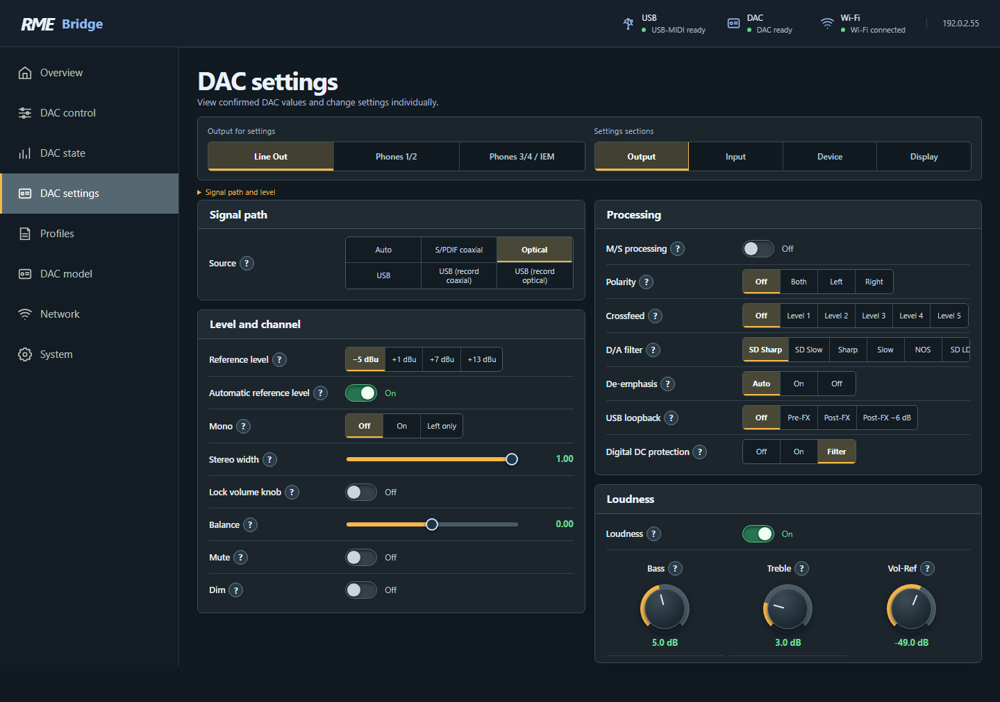
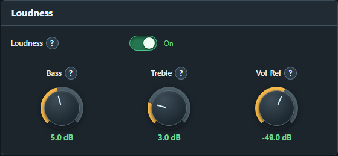
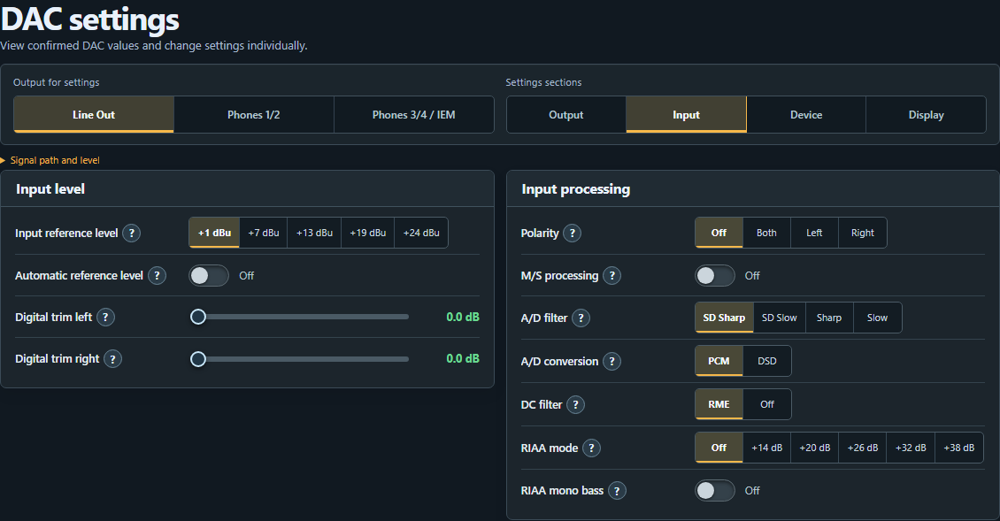
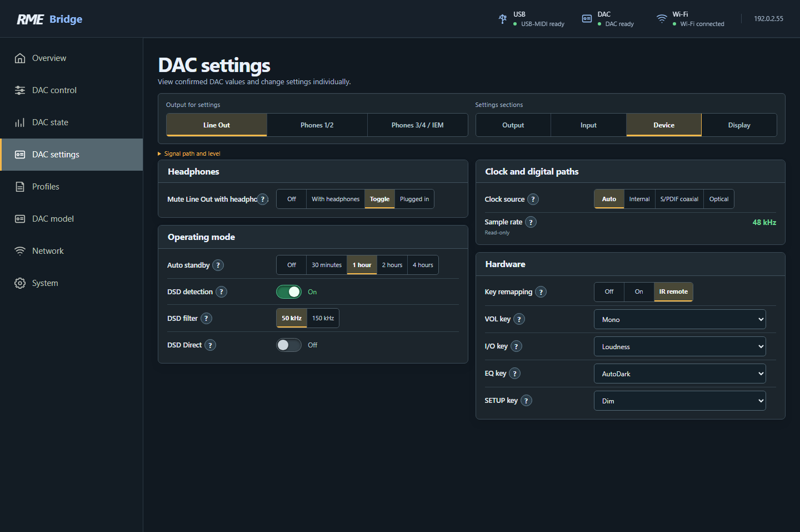
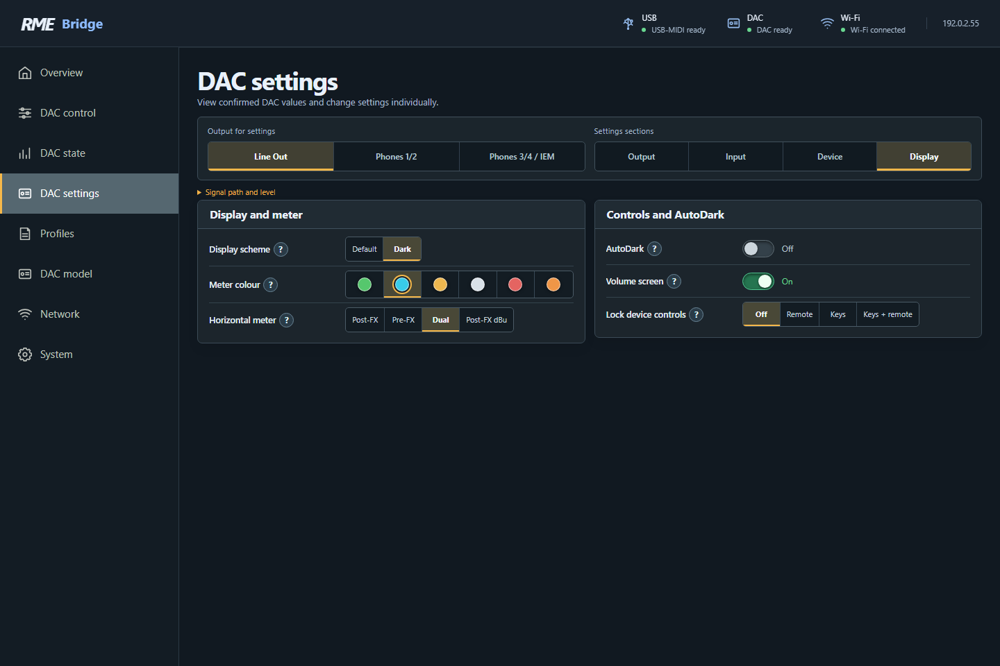

# Understanding DAC settings

[← Web pages](web-interface.md) · [Next: Profiles and backup →](profiles.md)

**DAC settings** has four sections: **Output**, **Input**, **Device** and **Display**. Select the right editing target first. Output settings belong to that channel; device settings apply to the DAC as a whole. Input settings concern the Pro models' analogue inputs, not Wi-Fi.

## Using controls and help

| Control | How to use it |
|---|---|
| Switch | Click or tap to turn On/Off. The DAC's readback confirms the state. |
| Segmented buttons | Select the labelled choice. The highlighted segment is selected. |
| Drop-down list | Open it and choose an entry. Ordinary settings do not have a separate Apply button. |
| Slider | Move with a mouse or finger. The number makes direction and effect explicit. |
| Knob | Hold and **drag vertically**. Up increases, down decreases; no circular gesture is needed. The **mouse wheel** also works while hovering. After focusing, arrow keys and Home/End are available. |
| **?** | Opens model-specific help, including operation, special conditions and the relevant manual reference for complex functions. |

The three Loudness knobs provide immediate preview. In this firmware, a dragged value is sent when released; mouse-wheel/key changes are sent after a brief pause. The DAC confirms every transmitted change. Quick intermediate movements are coalesced rather than replaying every old value. Avoid conflicting operation from multiple browsers.

A read-only value has no enabled editor. Unavailable values are omitted. A value not yet read is not filled in from a profile. Changes can alter physical level or routing; open **?** first when an option is unfamiliar.

## Output

### Signal path, level and channel

| Setting | Effect and practical use |
|---|---|
| **Source** | Audio source for the editing target. ADI-2 DAC offers Auto, coaxial, optical and USB variants; Pro models add AES, analogue and USB channel pairs according to mode. Choose a source that actually receives audio in this standalone setup; the Bridge sends no USB audio. |
| **Rear TRS output** | ADI-2/4 Pro SE, where available for the selected path: assigns rear TRS outputs to Line 1/2 or Phones 3/4. This changes real routing, not merely a label. |
| **Reference level** | Sets an analogue hardware level step. DAC Line steps are −5, +1, +7, +13 dBu; Pro Line steps +4, +13, +19, +24 dBu. Phones uses model-specific IEM/Lo-/Hi-Power steps. This is not a small Volume adjustment: a step can substantially increase physical level. |
| **Automatic reference level / Auto Ref Level** | Changes the analogue step to suit the volume range, making effective use of dynamic range. Switching may click quietly. With it off, recheck the actual level after changing reference manually. |
| **Mono** | Sums stereo. “Left only” sends the sum only to the left channel. Leave off for normal stereo. |
| **Stereo width** | 1.00 is normal stereo, 0.00 mono, −1.00 swaps left/right. Intermediate values change stereo content. It is not a substitute for Crossfeed. |
| **Balance** | Changes the relationship between left and right. 0.00 is the centre. Use deliberately to match a chain or audition individual channels, not as overall volume. |
| **Lock volume knob** | Locks normal adjustment of the relevant level at the physical Volume knob. It is not a website PIN or general volume cap. |
| **Mute** | Mutes the corresponding DAC path. This is actual DAC mute, not a playback command to music software. |
| **Dim** | Temporarily reduces level using the DAC's Dim function. Switching it off restores the previous listening level. Unlike Mute, audio remains audible. |

**dB and dBu are different.** The large Volume number is relative DAC level control. dBu describes the analogue reference. A manual reference change can alter actual loudness while the Volume number stays the same. The website does not use a percentage-volume scale.

### Processing

| Setting | Effect and practical use |
|---|---|
| **M/S processing** | Encodes stereo into mid/side or decodes M/S into stereo. Mid is L+R, side L−R. Usually leave off for ordinary music; otherwise mono/stereo content may be distributed differently. |
| **Polarity** | Inverts left, right or both channels. Do not confuse with Balance, channel swapping or a time delay. |
| **Crossfeed** | Adds a filtered portion of the other channel. Intended for headphones to make extreme left/right separation less artificial. The five levels are explained below. |
| **D/A filter** | Selects the converter's reconstruction filter. Choices and availability depend on model, converter and sample rate. See the filter explanation below. |
| **De-emphasis** | Corrects explicitly pre-emphasised audio. Auto follows the digital flag. Forcing On for normal material undesirably reduces treble. It may be unavailable with NOS. |
| **USB loopback** | Returns output audio to USB recording channels. Pre-FX is before processing, Post-FX after it; the tap remains before Volume. This Bridge setup has no USB-audio recording host. The function does not record audio inside the Bridge. |
| **Digital DC protection** | Off/On/Filter controls analogue-output protection against DC. On can mute excessive DC; Filter removes DC/infrasonic content. Detection and warnings can remain with Off. Do not mistake it for a bass tone control. |

### Crossfeed and its five levels

Crossfeed is not reverb or a surround effect. Bauer-binaural processing uses frequency shaping, a small delay and level adjustment. The damping value describes the **added cross-channel component**, not a blanket reduction of your music. Less damping produces a stronger effect.

| Choice | Frequency | Cross-channel component | Character |
|---|---|---|---|
| Off | — | None | Original separation |
| Level 1 | 650 Hz | −13 dB in the DAC manual; −13.5 dB in the Pro manuals | Very subtle |
| Level 2 | 650 Hz | −9.5 dB | Jan Meier characteristic |
| Level 3 | 700 Hz | −6 dB | Chu Moy characteristic |
| Level 4 | 700 Hz | −4.5 dB | Speaker-like presentation; RME specifies 30°/3 m |
| Level 5 | 700 Hz | −3 dB | Strongest offered blend |

These values follow the device manuals: ADI-2 DAC v1.8, chapter 8.6; ADI-2 Pro FS R v3.8 and ADI-2/4 Pro SE v1.3, Crossfeed chapters. Start with Level 1 or 2, compare against Off at similar listening volume, and choose by ear. An enabled setting does not prove it is effective in every special mode or at every high sample rate.

### Understanding D/A and A/D filters

**Sharp** variants cut off high frequencies more steeply; **Slow** variants roll off the highest range earlier. **SD** identifies a shorter-delay family; impulse response and latency differ. **NOS** has different treble/impulse behaviour and disables de-emphasis on applicable models. **SD LD** and **Brickwall** are additional model-dependent choices. The list on your Bridge is decisive; there is no identically named “best” filter for all models.

Pro models can lock filter selection at very high sample rates, then use a fixed filter. For a meaningful comparison, do not change reference level or Volume at the same time. Manuals explain the measurement curves; **?** provides the relevant model context.

### Loudness with three knobs

Loudness compensates for bass/treble being perceived less strongly at low listening levels. It is **not a fixed bass boost**: the effect decreases as DAC volume rises. The controls belong to the selected output.

| Setting | Meaning |
|---|---|
| **Loudness On/Off** | Enables or disables compensation. |
| **Bass** | Maximum bass boost: +1 to +10 dB in 0.5 dB steps. Not the separate Bass/Treble tone control. |
| **Treble** | Maximum treble boost: +1 to +10 dB in 0.5 dB steps. |
| **Vol-Ref** | DAC volume at or below which full boost applies: −90 to −20 dB in 0.5 dB steps. |

**Example:** Bass +5 dB, Treble +3 dB, Vol-Ref **−49 dB**. At −49 dB and quieter, the selected maximum boosts apply. As volume rises, compensation fades over the next 20 dB; at **−29 dB** it reaches zero. “Vol-Ref −49 dB” therefore does **not** set output volume to −49 dB and is not a volume cap.

Choose Vol-Ref around your lowest usual DAC listening volume. Once bass/treble sound right there, check louder playback too. A manual analogue reference change with Auto Ref Level off may require adjustment. Special DSP modes such as DSD Direct limit the effect; turning on a switch does not remove those limits.

## Input on ADI-2 Pro and ADI-2/4 Pro SE

| Setting | Effect and practical use |
|---|---|
| **Input reference level** | Analogue input sensitivity/headroom. Do not confuse with output Volume. Before changing it, check source and actual level at the DAC; model labels are not interchangeable between Pro families. |
| **Automatic reference level** | Adjusts input reference on overload. Helps prevent clipping, but does not replace proper source-level matching. |
| **Digital trim left/right** | Independent digital gain, 0 to +6 dB in 0.5 dB steps. Added gain reduces headroom; use different channel values only deliberately. |
| **Polarity** | Inverts left, right or both input channels. |
| **M/S processing** | Mid/side conversion on the input path. Use only for suitable material or intentional analysis. |
| **A/D filter** | Model-/sample-rate-dependent analogue-to-digital filter; distinct from the output D/A filter. |
| **A/D conversion PCM/DSD** | Selects recording format. DSD depends on suitable rates and routing. The Bridge is not a recording application. |
| **DC filter** | Removes input DC. Pro offers model-dependent Auto/ADC/RME choices; 2/4 Pro SE has its own selection. Some DSD modes disable filtering. |
| **RIAA mode** | 2/4 Pro SE only: moving-magnet turntables, RIAA equalisation and gain steps. Do not enable for an ordinary line source. This turntable mode changes other input conditions. |
| **RIAA mono bass** | 2/4 Pro SE only: sums bass below 150 Hz to mono in RIAA operation. Can reduce rumble/feedback components. Not a full-band music Mono setting. |

In RIAA mode, manual input reference and its automatic setting are not used as in line operation; the appropriate DC filter remains active. Choose RIAA gain using the **DAC's level meters**, not the Bridge's volume number. The Bridge provides no recording-level meter.

## Device

### Operating mode and DSD

| Setting | Effect and practical use |
|---|---|
| **Auto standby** | Off, 30 minutes, 1, 2 or 4 hours. The DAC enters standby according to its inactivity/audio-detection rules. This does not switch off the Bridge. |
| **DSD detection** | Enables/disables DSD detection at digital inputs. |
| **DSD filter** | Available high-frequency filters limit ultrasonic DSD noise, not normal PCM tone. |
| **DSD Direct** | Where offered: bypasses DSP and ordinary digital volume control on rear outputs. Safeguard downstream gain before enabling; a digital Volume number is not sufficient protection. |
| **Basic mode** | Pro models: Auto, AD/DA, USB, Preamp, Digital Through, DAC. Determines routing and further options. The Bridge creates a real USB connection but supplies no audio. |
| **Digital output source** | Pro models: Default or processed Main Out path. Main Out can transfer DSP and volume control to digital outputs; this is real audio routing. |

**AutoDark is not standby.** AutoDark hides the display while audio continues. Auto Standby puts the DAC into its low-power state; waking it requires the optional IR transmitter or operation at the DAC itself.

### Headphones and toggle behaviour

| Setting | Effect and practical use |
|---|---|
| **Mute Line Out with headphones** | ADI-2 DAC: Off can leave multiple outputs active; With headphones responds to plugs. **Toggle** corresponds to Toggle Ph/Line and **Plugged in** to Toggle plugged. These modes are prerequisites for the separate Bridge switching button. |
| **Dual Phones** | Pro models: enables Phones 1/2 in addition to Phones 3/4. Depending on connection and mode, paths can operate together. |
| **Balanced TRS headphones** | Pro models: uses both TRS sockets as separate balanced left/right channels. Connect only appropriately wired headphones, not two ordinary stereo headphones. On 2/4 Pro SE, Pentaconn can also affect this mode. |
| **Toggle headphones/Line** | Pro models: configures destinations of the device's toggle function. Selecting the configuration does not itself trigger switching. |
| **Mute Line with Phones 1/2** | Pro models: responds to a detected plug and needs appropriate Dual Phones configuration for the extra path. |
| **Mute Line with Phones 3/4** | Pro models: mutes Line when corresponding headphones are connected. |

The DAC manages its analogue sockets. The Bridge exposes suitable MIDI settings; it does not replace plug detection, internal ramps or protection functions. Do not try balanced headphone mode with unsuitable wiring.

### Clock and digital paths

| Setting | Effect and practical use |
|---|---|
| **Clock source** | Auto, internal or model-specific digital input. Matches conversion to the required clock. Pro DAC mode can determine the selection itself. |
| **Sample rate** | DAC-reported rate. Over this USB connection it is **read-only** on the Bridge, not forced by a control. |
| **S/PDIF input** | Pro models: coaxial/optical digital path or Auto. Distinct from an individual output's Source setting. |
| **Sample-rate converter (SRC)** | Pro models: converts AES or S/PDIF to the device clock. Helps join different digital clocks; upsampling adds no new musical information. |
| **SRC level** | 0 or −3 dB where offered. −3 dB reserves headroom for intersample peaks in the converted digital chain. Not an analogue Volume control. |
| **Optical output** | Pro models: S/PDIF or ADAT. The receiving device and transfer format must match. |

### Key remapping

**Key remapping** can be off, enabled at the device and remote, or active only for IR. The following lists define actions for **VOL**, **I/O**, **EQ** and **SETUP**; Pro models add applicable **IR keys 5, 6 and 7**. Assigning an action changes what a later key press does – it does not press the key now.

Lists can include existing Mono, Dim, Loudness, Crossfeed or filter actions. Internal setup/EQ actions may also be assigned. This does **not** mean the Bridge stores or edits EQ curves or setup contents. When such a key is pressed later, the DAC's stored values and effects apply, possibly including different levels. Check remapping first if a key behaves unexpectedly.

## Display

| Setting | Effect |
|---|---|
| **Display scheme** | Default or Dark on the DAC display. Does not switch it off. |
| **Meter colour** | The six device choices: Green, Cyan, Amber, Monochrome, Red, Orange. Select a colour dot; separate from the website's nine accents. |
| **Horizontal meter** | Pre-FX before DSP/Volume, Post-FX after, Dual both, or Post-FX dBu with an analogue-referenced value where offered. The thin outer line in Dual is Pre. This configures the meter on the DAC, not one on the Bridge website. |
| **AutoDark** | Blanks display/LEDs after inactivity while playback continues. Interaction and warnings can wake it temporarily. |
| **Volume screen** | Enables the DAC's corresponding large volume-display screen. Does not change level. |
| **Lock device controls / Lock UI** | Locks the remote, keys or both according to selection. Not a website access control. Know how to release the lock on your DAC before enabling it. |

## A useful adjustment sequence

For a small headphone adjustment, first select the actual headphone path as editing target and wait for any safety reduction. Try Crossfeed Level 1 and compare. Then enable Loudness and adjust Bass, Treble and Vol-Ref. Do not change Source, reference and operating mode simultaneously; otherwise the effect of one setting is hard to judge.

For observation without changes, use **DAC state**. Use a **Bridge profile** to retain AutoDark and Volume. A complete DAC-configuration backup including EQ requires the appropriate RME Remote feature, not the Bridge's profile backup.

[Next: Profiles and backups →](profiles.md)
