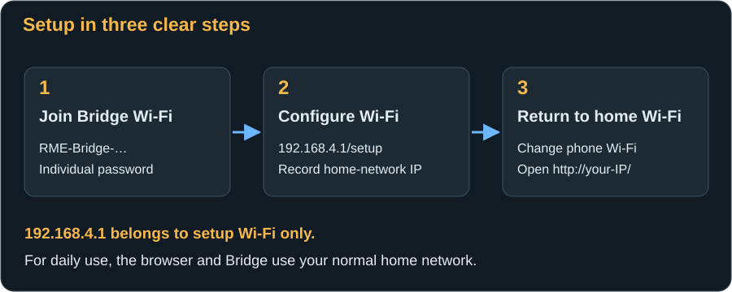
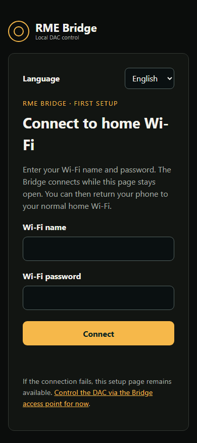

# First start: Connect Wi-Fi and the DAC

[← Installation](installation.md) · [Next: The web pages →](web-interface.md)

After flashing, initially leave the Bridge connected to the computer so you can read its boot messages. The DAC can remain off or disconnected during Wi-Fi setup.

## Joining the setup Wi-Fi

1. Record the Wi-Fi name and individual password from the [serial boot message](installation.md#4-read-the-setup-password). The name has the form `RME-Bridge-A1B2C3`; the final characters distinguish devices.
2. In your phone/computer's Wi-Fi list, connect to **this Bridge network**, not yet to your home Wi-Fi. Enter the recorded Bridge password. This is **not** your router's password.
3. If the phone reports “No internet”, stay connected. That is normal: the Bridge is not an internet connection. Automatically switching to mobile data or another Wi-Fi network can prevent the next step.
4. In the browser address bar, enter exactly **`http://192.168.4.1/setup`**. Do not enter it into a search engine. Use `http`, not `https`.
5. A form with **Wi-Fi name**, **Wi-Fi password** and **Connect** must appear. If you only see the DAC page saying home Wi-Fi is not connected, explicitly open **`/setup`**.

## Enter your home Wi-Fi details

1. Choose **German** or **English** here if desired. The choice also applies to the normal Bridge pages.
2. Enter the **exact name** of your 2.4 GHz Wi-Fi network. This is a text form, not a list of scanned networks. Case and spaces are part of the name. A hidden network also needs its exact name.
3. Enter your **home Wi-Fi password**. This second password connects the Bridge to the router. Normal keys must contain 8–63 characters; a 64-character hexadecimal key is also accepted. An open network or enterprise network requiring a separate username is not this setup method.
4. Press **Connect** once. The Bridge stores the credentials and attempts connection while you stay on the Bridge Wi-Fi. The password field is cleared afterwards; that does not remove the saved credentials.
5. Wait for **“Bridge reachable on home Wi-Fi”** and the displayed address, for example `http://192.168.1.50/`. Record **your own** address. Seeing the form does not by itself confirm connection.
6. After about 30 seconds without success, a message appears. Check name, password, 2.4 GHz availability and router access, then save corrected details. The setup page remains available in this situation.

The Wi-Fi name is limited to 32 bytes; special characters can reach that limit with fewer than 32 visible characters. The router assigns the Bridge's IP automatically through DHCP. There is no static-IP field on the Bridge website; if needed, create a DHCP reservation for it in your router.

## Return to your home Wi-Fi

1. Reconnect your phone to your **normal home Wi-Fi**.
2. Open the Bridge's **home-network IP** displayed during setup. `192.168.4.1` is only its address on the setup network.
3. **Overview** should appear and Wi-Fi should show connected. **Network** repeats the address, network name and signal strength. Bookmark the normal address.

After successful home-network connection, the protected setup access point closes automatically: after approximately two minutes if no AP clients remain, or after approximately ten minutes even if a phone remains connected. Return to home Wi-Fi soon after noting the address.

Everyday operation does not need internet access. Accurate event-log timestamps do require the Bridge to reach an internet time server. Without synchronisation, uptime since boot remains available.

## Changing Wi-Fi later

Saving new Wi-Fi credentials is allowed **only through the protected Bridge access point**. The normal Network page on home Wi-Fi is a status display and does not show passwords.

If the previously saved home Wi-Fi is unavailable for approximately 30 seconds, the Bridge opens its access point again while continuing to try the home network. Join the known AP using your retained AP password and open `/setup` as above. This can happen after replacing a router. If needed, temporarily make the old network unavailable; do not immediately erase the Bridge completely.

The saved AP password remains the same. Wi-Fi recovery is not a factory reset. After successful reconfiguration, use the newly displayed home-network IP.

## Prepare the DAC

### Audio input and safe levels

Keep the DAC on its own power supply and switch it on at the device. Start with your monitoring system quiet or muted. Audio must arrive separately, for example through optical or coaxial S/PDIF. On an ADI-2 DAC, **Source Auto** can select USB when USB is connected. Since the Bridge supplies no audio, explicitly select the actual audio input, such as **Optical** or **S/PDIF coaxial**.

On Pro models, also check Basic Mode: the USB connection can influence automatic mode selection. Choose a mode and source appropriate to the intended playback and consult the device's RME manual.

### Enable MIDI Control

Connecting USB alone is not sufficient. On the **DAC itself**, enable **MIDI Control = ON**:

| Device | Where to find the option |
|---|---|
| ADI-2 DAC / DAC FS | **SETUP → Options → Remap Keys / Diag** or Remap Keys / Diagnosis |
| ADI-2 Pro | **Device Mode** in the SETUP/Options area |
| ADI-2/4 Pro SE | **Device Mode** in the SETUP/Options area |

Use the DAC's controls to navigate its menu and find the setting by name. Menu contents and appearance depend on its firmware. If **MIDI Control** is missing altogether, check model and firmware support with RME. The [RME download page](https://rme-audio.de/downloads.html) provides manuals and manufacturer updates. Update RME firmware using RME's computer-based procedure, not through this Bridge.

This prerequisite and menu mapping are also described in the [RME ADI-2 Remote manual](https://rme-audio.de/downloads/adi2remote_e.pdf). You do not need the Remote app running alongside the Bridge; they cannot occupy the DAC's USB socket simultaneously anyway.

## Connect USB to the DAC

1. Check the [socket mapping](installation.md#do-not-confuse-the-two-usb-sockets) once more.
2. Disconnect any existing DAC USB connection to a computer or streamer.
3. Connect the USB-C-to-USB-B data cable from **Bridge native USB → DAC USB-B**. UART continues to power the Bridge.
4. Open the Bridge website. USB detection should progress to **USB-MIDI ready**; the model appears and the status becomes **DAC ready**. A model picture or “USB detected” alone does not prove working MIDI control.
5. If values are still missing, allow the initial read to complete. **System → Refresh DAC status** requests a fresh read without resetting settings.

## Your first small adjustment

For an enabled ADI-2 DAC FS:

1. Open **DAC control** and check that **Line Out** is the intended editing target. Compare the large dB value with the DAC's display.
2. Press **−0.5 dB** once. For example, −67.5 dB becomes −68.0 dB: a more negative value is quieter.
3. Wait for the confirmed value. Press **+0.5 dB** once to return.
4. If AutoDark hides the DAC display, turn **AutoDark off** to read it comfortably. Avoid waking it by unintentionally changing volume.

If the volume control is not enabled, do not try to bypass identification by selecting a different model. **DAC settings** determines the available options. Stop if an error or discrepancy appears, read the current state and use [Troubleshooting](troubleshooting.md).

## Afterwards: Operate without a computer

Once setup works, replace the computer connection at the UART socket with stable USB power. Leave native USB connected to the DAC. After restarting, the Bridge reconnects to the stored Wi-Fi; the phone does not have to remain on the setup network.

The DAC may be off while the Bridge remains powered. The website and IR On remain available if a transmitter and model are known; USB-MIDI controls require a DAC response. [Read more about IR power](web-interface.md#power-on-and-off-over-ir).

[Next: The web pages in detail →](web-interface.md)
