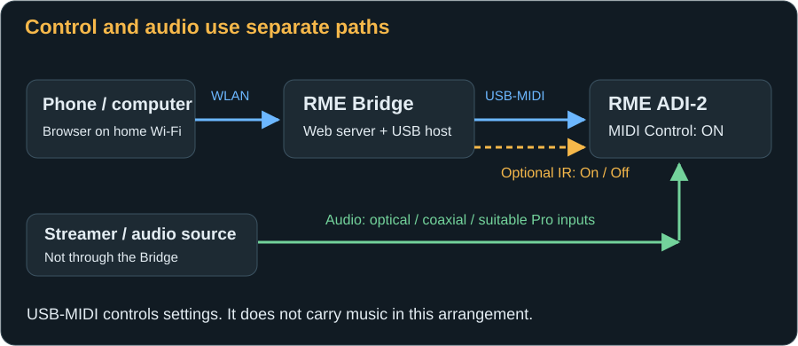

# RME Bridge: Start here

Want to operate your RME DAC from the sofa, your desk or the studio using a phone? The RME Bridge connects a small ESP32 board to the DAC's USB port. You then open a page on your Wi-Fi network: no additional phone app, continuously running computer or RoonPilot required.

This guide takes you from an empty board to everyday operation. You do not need programming skills or knowledge of MIDI commands. Before connecting anything, read the instructions for the two USB sockets and the optional IR transmitter's power supply.

## Your route to a working Bridge

| Step | What you do | How you recognise success |
|---|---|---|
| 1 · Prepare | [Check board, cables and power](installation.md#what-you-need). | You know which socket connects to the computer and which to the DAC. |
| 2 · Install | [Write the firmware to the board](installation.md#installing-the-firmware-flashing). | The board starts and reports its setup Wi-Fi. |
| 3 · Configure | [Connect the Bridge to your Wi-Fi](first-start.md#joining-the-setup-wi-fi). | Its website is reachable at its home-network IP address. |
| 4 · Connect the DAC | [Enable MIDI Control on the DAC](first-start.md#prepare-the-dac). | The website shows “DAC ready”. |
| 5 · Operate | [Explore the web pages](web-interface.md). | A small volume step is confirmed by the DAC. |
| 6 · Personalise | Use [DAC settings](dac-settings.md) and [profiles](profiles.md). | You understand what changes do and what a backup does not contain. |

If something does not work as expected, see [Troubleshooting](troubleshooting.md). A [REST API](api.md) is available for your own automations; you can skip that chapter for normal operation.

## What the Bridge does – and does not do

The Bridge sends control commands over USB-MIDI and reads the DAC's responses. Here, MIDI carries settings, not music. Audio must still reach the DAC through a suitable audio input, such as optical or coaxial S/PDIF.

While connected, the DAC's USB port belongs to the Bridge. It cannot also connect to a computer or USB streamer. The Bridge is not a USB audio streamer or USB pass-through. On Pro models, the operating mode and signal routing must also match your cabling.

The web pages display current values, change enabled settings and configure the Bridge. An optional IR transmitter handles power on and off: there is no corresponding MIDI power command. No IR receiver or remote-learning procedure is required; the model-specific codes are built in.

This guide does not include Roon integration, Bluetooth pairing, equaliser curves, an EQ preset editor, or direct loading/saving of the DAC's internal setups. The RME Bridge operates independently here. Do not confuse it with the RoonPilot IR Bridge.

## Which RME DAC can I use?

The interface recognises the **ADI-2 DAC**, **ADI-2 Pro** and **ADI-2/4 Pro SE** families. The actual MIDI response, DAC firmware and operating mode determine availability – not simply the device picture you select.

| Feature in this firmware | ADI-2 DAC FS | ADI-2 Pro | ADI-2/4 Pro SE |
|---|---|---|---|
| Identify the model and display reported values | Yes | Yes | Yes |
| Model-specific non-EQ settings | Yes, where reported by the DAC | Where reported and enabled | Where reported and enabled |
| Analogue input settings | No analogue input | Yes | Yes, plus RIAA functions |
| Volume slider and ±0.5 dB buttons | Enabled for the recognised DAC FS USB identity | Not enabled | Not enabled |
| AutoDark shortcut on “DAC control” | Enabled | Not enabled; see the parameter section | Not enabled; see the parameter section |
| Create and apply Bridge profiles | Yes | Not available | Not available |
| “Switch on DAC” | Yes, under the documented conditions | Not available | Not available |
| Model-specific IR power codes | Yes, with a suitable transmitter | Yes, with a suitable transmitter | Yes, with a suitable transmitter |

A grey control does not mean that you need to “unlock” it. [Possible causes are explained here](troubleshooting.md#a-control-is-grey-or-an-option-is-missing). Automatic identification distinguishes the families; it does not guarantee support for every historical hardware or firmware variant.

## Three things to remember

1. **The editing target is not the active output.** Selecting “Phones” initially means viewing and editing that channel. Physical switching is a separate function.
2. **A confirmed value comes from the DAC.** An old value is not treated as current after connection loss. “IR sent”, however, only confirms transmission.
3. **A Bridge profile is not a complete DAC backup.** It contains the model, editing target, AutoDark and one volume value. EQ, other DAC settings and Wi-Fi credentials are not included.

## Start safely

Set speakers and headphones to a low level before the first change. Source, reference level, DSD Direct and operating mode can affect output differently from a small digital volume change. The −60 dB cap when selecting Phones is a starting precaution, not universal hearing protection: headphones, reference levels and gain differ.

Use the Bridge only on a trusted local network. The website and API have no user login. Internet port forwarding is therefore unsuitable. [Read the network safety guidance](troubleshooting.md#network-and-privacy).

## Using this guide

Menu names match the English interface; the [web-page chapter](web-interface.md#navigation) also lists the German equivalents. A **?** beside a DAC setting opens help for the identified model. The guide describes implemented features; not every DAC shows every illustrated option.

Screenshots come from the real interface. Values, profile names and network addresses are examples. `192.0.2.55` is a documentation-only address: always substitute your Bridge's actual IP. The DAC's dark display scheme and the website's accent colour are separate settings.

[Next: Prepare the board and firmware →](installation.md)
