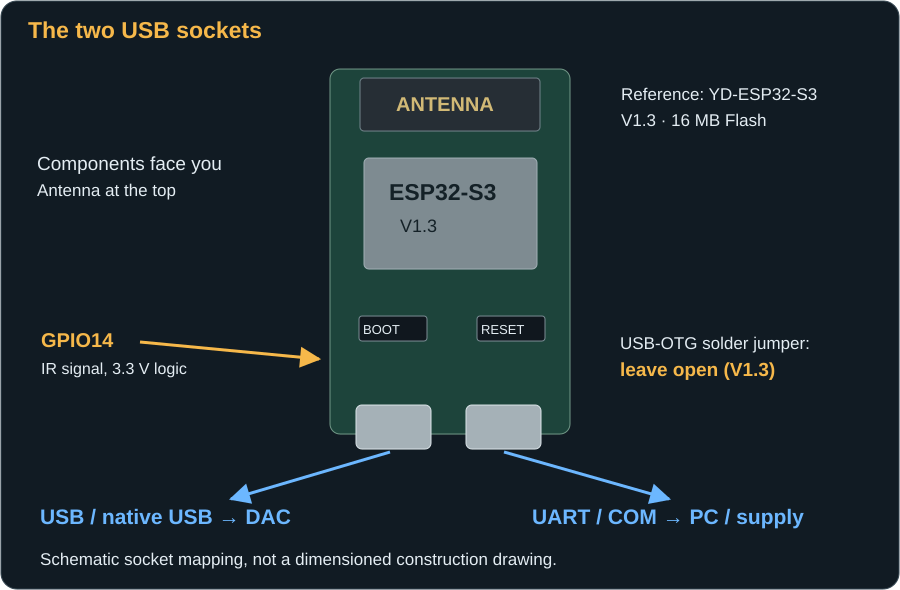
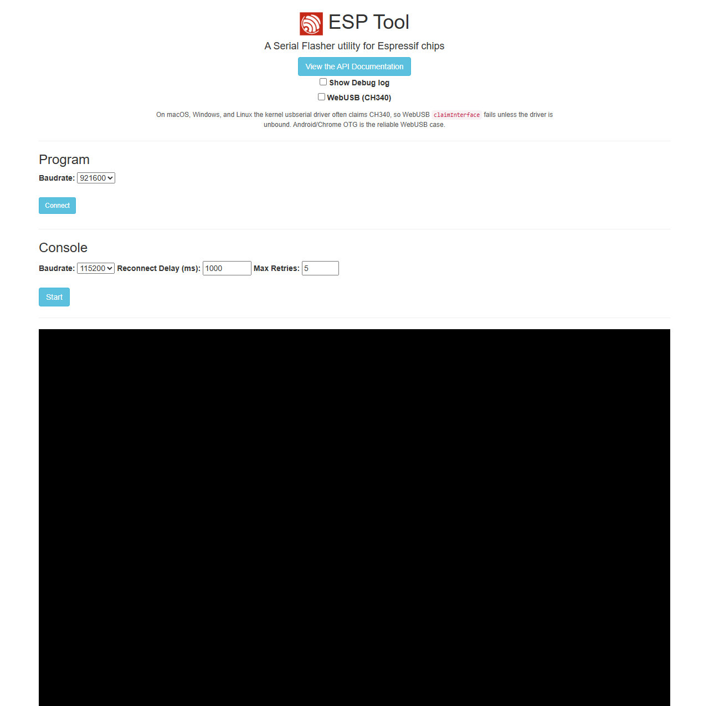
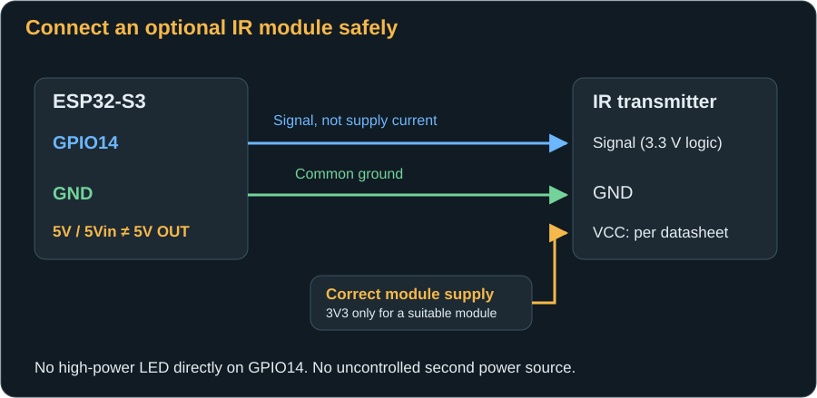

# Board, connections and firmware

[← Start here](index.md) · [Next: First start →](first-start.md)

## What you need

| Item | What matters |
|---|---|
| ESP32-S3 board | Reference hardware: **YD-ESP32-S3 V1.3**, 16 MB flash, with two USB-C sockets. Firmware is configured for 16 MB flash. Do not substitute an ESP32, ESP32-C3 or arbitrary S3 board without checking compatibility. |
| Computer for installation | Windows, macOS or Linux with a desktop browser supporting Web Serial, such as Chrome or Edge. Subsequent DAC operation also works from a phone. |
| USB data cable to the computer | Connects to the board's **UART/COM socket**. A charge-only cable is insufficient. |
| USB-C-to-USB-B data cable to the DAC | USB-C connects to the board's **native USB socket**, USB-B to the DAC. Do not place a USB hub in this connection. |
| Stable USB power | Powers the Bridge through its UART socket; the computer can supply it initially. The DAC keeps its own power supply. |
| Wi-Fi | A reachable, password-protected **2.4 GHz** network; the phone/computer must be able to reach the Bridge on the same local network. |
| RME Bridge firmware files | Four matching files from the RME Bridge firmware package, not RoonPilot or IR Bridge firmware. The guide itself contains no firmware. |
| Optional IR transmitter and wires | Only needed for power on/off from the website. Its supply and signal input must suit the actual module and 3.3 V logic. No IR module is needed for USB-MIDI settings. |

**Flash** is the board's non-volatile storage. **Flashing** means writing the RME Bridge software into that storage. The software is called **firmware**. If you have the correct firmware files, you do not need to program it yourself or install a source-code editor.

Place the exposed board on a dry, non-conductive surface. Keep screws, metal enclosures and loose wire ends away from contacts. Change GPIO wiring only with the Bridge switched off and disconnected from USB.

## Do not confuse the two USB sockets

The illustration shows the reference board with its antenna up and components facing you. Another revision may have different sockets, labels or power paths. Always check your board's labels as well.

| Socket | Purpose | Connect to |
|---|---|---|
| **UART / COM** | Flashing, serial boot messages and Bridge power | Computer during installation; USB power supply afterwards |
| **USB / native USB / OTG** | USB host for the RME DAC's MIDI connection | RME DAC using a USB-C-to-USB-B data cable |

A **USB host** controls a USB connection. In normal operation, the Bridge is the host and the DAC is the USB device. The native socket is therefore not a simultaneous second computer connection. Use the UART/COM socket for flashing and initially leave the DAC disconnected.

On the reference YD-ESP32-S3 V1.3 setup, the rear **USB-OTG solder bridge remains open**. No soldering is required for this setup. Do not close a jumper because instructions for a different board revision say to do so. A “USB-OTG” label does not automatically mean a jumper must be closed for this firmware.

## Prepare the computer

1. Connect only the UART/COM socket directly to the computer using a USB data cable. Temporarily disconnect other ESP boards where possible to avoid selecting the wrong device.
2. In the browser dialog, choose this board's **CH343/USB-to-serial port**. There is no fixed COM number. If identification is unclear, optionally use **Device Manager → Ports (COM & LPT)** on Windows to see which port appears when connecting it. On macOS, UART may appear as `cu.usbserial…` or a vendor-specific serial device.
3. If no port appears or an unknown device is shown, check the cable and socket first. The reference board uses a CH343 USB-to-serial chip. If a driver is needed, use the [official WCH CH343 download](https://www.wch-ic.com/downloads/CH343SER_EXE.html), not an arbitrary driver website. A differently populated board needs the driver for its actual chip.
4. Close serial monitors and other flashing programs. Normally only one program can use a serial port at a time.
5. Use a normal browser window and grant access to the serial port you selected when prompted. If Web Serial is unavailable, use a supported desktop browser. The phone is for subsequent operation, not a flashing requirement.

**Already installed RoonPilot or the IR Bridge?** The familiar sequence of data cable, browser device selection, writing, verification and restart remains the model. The port rule differs here: native “USB JTAG/serial debug unit” is not the UART connection used in this guide. Do not rotate the RME Bridge's plug 180 degrees to select another processor; it has two separate sockets and one ESP32-S3 for this procedure. Do not install RoonPilot or IR Bridge firmware on the RME Bridge.

## Installing the firmware: Flashing

The standalone RME Bridge currently has **no dedicated web installer and no firmware-upload menu on its own website**. The following method uses Espressif's general [ESP Tool](https://espressif.github.io/esptool-js/). It runs directly in a browser. It does **not supply RME firmware**: you need the files separately from a matching RME Bridge firmware package.

### 1. Check the firmware package

Extract the package into a folder. All four files must belong to the **same version**. Do not mix in another project's bootloader or partition table. The documented setup uses:

| Flash Address | File | Purpose |
|---|---|---|
| `0x0` | `bootloader.bin` | ESP32-S3 startup program |
| `0x8000` | `partition-table.bin` | Flash memory layout |
| `0xf000` | `ota_data_initial.bin` | Initial application-slot selection |
| `0x20000` | `roonpilot_rme_bridge.bin` | Bridge application, including its web pages |

If the supplied firmware package specifies different addresses, do not guess or mix files: first clarify whether that package fits your board.

`roonpilot_rme_bridge.bin` alone is **not a complete first-installation image**. It must not be placed at `0x0`. A package explicitly supplied as a complete merged factory image would use a different installation method; this guide describes four separate files.

### 2. Enter flashing mode

1. Leave the DAC disconnected and the board connected to the computer through UART.
2. Open [ESP Tool](https://espressif.github.io/esptool-js/). Leave **WebUSB (CH340)** unchecked; this method uses the UART serial port.
3. In **Program**, select an initial **Baudrate** of `115200`. This is the serial transfer rate, not Wi-Fi speed.
4. Click **Connect** and select the board's previously identified serial port. The tool must recognise an **ESP32-S3**. Do not continue if it reports a different chip.
5. If automatic connection fails: hold **BOOT**, briefly press and release **RESET**, then release **BOOT**. Try connecting again. If necessary, hold BOOT during connection and release it once the chip is identified. BOOT is not a setting to keep permanently enabled.

### 3. Write the files

1. Once connected, the file rows appear. Set the first address to **`0x0`**, not the potentially prefilled `0x1000`.
2. Select `bootloader.bin`. Use **Add File** to create three more rows and assign addresses and files exactly as shown in the table.
3. Use **Flash Mode: dio**. **Flash Frequency: keep** retains the package's frequency; the documented package uses 80 MHz. **Flash Size: detect** must match the 16 MB board; do not force a smaller capacity.
4. A new, empty board does not require a precautionary **Erase Flash**. Erasing may be appropriate when deliberately replacing another firmware or resetting completely. **Erase Flash removes all Bridge settings, profiles and the setup password.** Use it deliberately; export profiles and record network settings before erasing an already configured Bridge.
5. Click **Program**. Leave cable, board and browser tab undisturbed while writing. Check completion of every file and any error message. Do not unplug after just the first progress bar reaches 100%.
6. Choose **Disconnect**. If the firmware does not start automatically, briefly press **RESET** without holding BOOT.

Additional connection guidance is available in [Espressif's troubleshooting documentation](https://docs.espressif.com/projects/esptool/en/latest/esp32s3/troubleshooting.html).

### 4. Read the setup password

On first start, the Bridge generates its own random **16-character password** for its setup Wi-Fi. There is no shared default password.

1. Disconnect the ESP Tool's **Program** session first.
2. In **Console**, select `115200` baud, click **Start** and choose the same UART port.
3. Briefly press the board's **RESET** button. Boot messages appear in the console.
4. Find `First setup: connect to RME-Bridge-… with password …`. Record the Wi-Fi name and password **privately**. This line contains the real password; do not put it in public screenshots or support posts.
5. **Stop** closes the console and releases the port. The board can remain connected to the computer until Wi-Fi setup is complete.

If the Bridge already has Wi-Fi credentials, the first-start line may not appear again. The password is stored on the Bridge but cannot be retrieved from the Network status page. Keep it from the first start. [What to do if you lose it](troubleshooting.md#the-setup-password-is-lost).

## Connect an optional IR transmitter

USB-MIDI works without this step. IR is only needed to turn the DAC on or put it into standby from the website. The firmware drives **GPIO14**, not GPIO4. Model-specific power codes are built in; there is no learning procedure.

| Connection | Reference board connection | Important |
|---|---|---|
| Control signal | Pin labelled **14**, bottom left with antenna up | 3.3 V logic signal, not a power supply |
| Ground / GND | Pin labelled **G** / GND | Connect to the transmitter's ground |
| Module supply | **3V3 only for a module specified for it** | Check the actual module's supply voltage and current requirements |
| **5V / 5Vin** pin | Do not assume it supplies transmitter power | Not a guaranteed 5 V output in this setup |

Signal, positive supply and ground are arranged differently on different modules. Labels such as `S`, `+`, `−`, or wire colours do not establish a universal pinout. Follow your transmitter's datasheet. A 5 V module that appears to work at 3.3 V is not automatically specified for that supply.

If the module needs 5 V, use an appropriate, correctly designed supply. Do not simply connect another supply to `5Vin` or USB: this can back-feed a computer or power supply. Do not apply a 5 V signal to GPIO14. Use a transmitter with a suitable driver stage; never drive a high-power IR LED directly from the GPIO.

Aim the transmitter at the DAC's IR receiver. Keep metal and cable bundles away from the ESP32 antenna. Wires from the lower pins can run down the side. A short USB plug housing makes enclosure assembly easier.

## Updating versus starting over

A firmware update is not the same as a factory reset. Follow the matching package's update instructions. Writing a compatible package **without a full erase** is not intended to remove saved settings; nevertheless, do not assume settings survive every firmware change. Export profiles first and retain the Wi-Fi details and setup password.

The current Bridge website has neither OTA upload nor a factory-reset button. An intentional fresh setup requires **Erase Flash** followed by a complete installation. The next first start creates a new AP password; profiles are lost without a previous backup. Do not use this as the first remedy for a missing DAC response.

[Next: Set up Wi-Fi and connect the DAC →](first-start.md)
