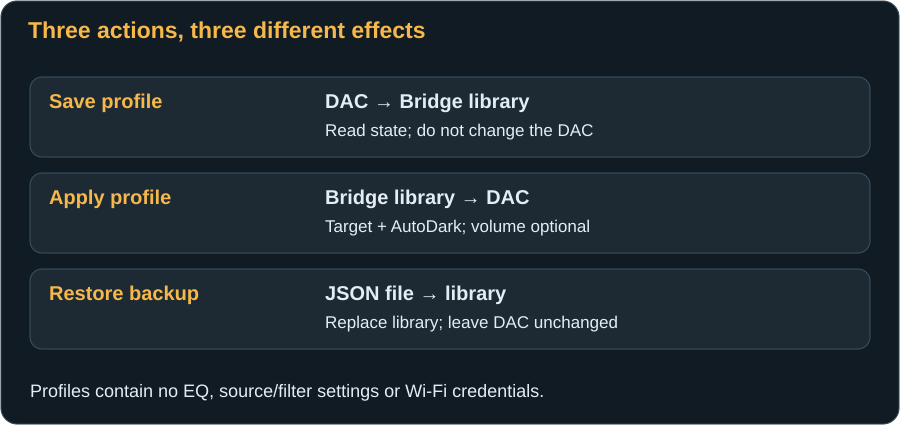
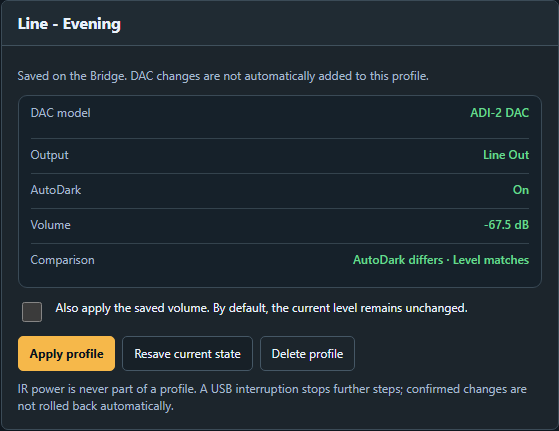
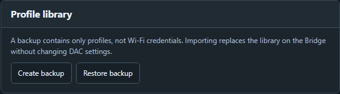

# Saving and backing up profiles

[← DAC settings](dac-settings.md) · [Next: Troubleshooting →](troubleshooting.md)

A **Bridge profile** is a named snapshot of specific DAC-confirmed values, stored persistently on the Bridge. It is useful for “Evening listening” or “Quiet headphones”, but is not a complete RME setup or a continuously updated DAC copy.

## What a profile contains

| Included | Not included |
|---|---|
| Profile name and ID | Music, playlists or playback state |
| DAC model identity | DAC or Bridge firmware |
| Editing target: Line Out, Phones or IEM | Physical output toggling or IR power |
| AutoDark | Source, reference, Loudness, Crossfeed and other additional parameters |
| This one output's volume | EQ curves, EQ presets or internal RME setups |
| | Wi-Fi credentials, Bridge language or website accent |

Up to **eight profiles** can be stored. This firmware enables capture and application for a matching, MIDI-identified **ADI-2 DAC FS**, not Pro models. The library backup is consequently not a universal exchange format for all DACs or RoonPilot.

## Create a new profile

1. Set the intended AutoDark state and a safe volume at the DAC or through the Bridge.
2. Choose the correct **editing target** on DAC control. If selecting Phones, wait for any required safety reduction.
3. Open **Profiles**. Check that **New profile** shows the intended model, output and confirmed level.
4. Enter a unique name, for example **Evening listening**. The limit is 48 UTF-8 bytes; accented characters and emoji can use multiple bytes. Short names easily stay within it. Avoid leading/trailing spaces and duplicate names.
5. Press **Save profile**. It appears in **Saved profiles**. Saving does not change the DAC.

The capture is a moment in time: later DAC changes or changes from another browser **do not automatically update** the saved profile.

## View and compare a profile

Select a profile in the list. The preview shows stored model, editing target, AutoDark and volume. **Comparison** indicates matches and differences against the current DAC. Merely selecting the list entry neither sends a command nor changes the editing target.

“Volume differs” can appear even if you intend to apply without including volume. That is not an error: stored volume is deliberately optional.

## Apply a profile

1. Check the model and output in the preview. A matching DAC must be online with current values.
2. Decide whether to enable **“Also apply the saved volume”**. The checkbox is **off** by default and resets to off when selecting a profile.
3. Press **Apply profile** once. Progress, the current step and confirmed levels are displayed.
4. Wait for **“Profile fully applied”** and check the resulting state.

Without volume inclusion, AutoDark is matched and the editing target selected. **Exception:** changing the target to Phones still performs its safety reduction to at most −60 dB. “Do not apply volume” therefore does not mean a Phones-target change can never reduce level.

With volume included, the DAC follows confirmed steps toward the stored value. When newly changing to Phones, a louder saved value is not raised back above the selection cap or a quieter level reached during selection. If that target was already selected, without a target change, normal profile values apply; this is not a permanent global Phones cap.

**Example:** You are editing Line Out and select a Phones profile storing −40 dB. Changing target lowers the current Phones level if needed. Application does not then jump back to −40 dB. A profile storing −71 dB can lower the level further when volume is included.

Application does **not** physically toggle the output or send **any** power code. A profile may therefore edit a channel you are not listening to; check the separate active-output display where needed.

## Stop and recover after interruption

**Stop further steps** stops the sequence after any current DAC command finishes confirmation. It is not Undo. Already confirmed changes remain.

USB loss, another DAC, an external volume change or missing confirmation can interrupt application. Reconnect, refresh the state and check which values already match. Do not blindly repeat a large volume change. After checking, you can apply the same profile again; the website starts from current values, not an unchecked old state.

## Update or delete a profile

**Resave current state** replaces the selected snapshot with the current state and asks before replacing. Check the current editing target first; this recaptures profile values rather than applying them to the DAC.

**Delete profile** removes the selected entry after confirmation. It changes neither current DAC volume nor AutoDark. Download a backup first if you want to retain it.

## Create a backup

1. Open **Profiles → Profile library**.
2. Press **Create backup** and save the downloaded JSON file somewhere useful.
3. Keep it unchanged. JSON is the backup's structured file format; you do not need to edit it manually.

Backup reads the Bridge's saved library, so the DAC does not need to be online. It contains all stored profiles but only the fields listed above. Save a new file after important changes and optionally retain the previous version. Check that the browser actually saved a download.

For a **complete DAC configuration** including EQ, use the RME Remote software's backup function according to its manual. Those setup files are not Bridge profile backups and cannot be imported here.

## Restore a backup

1. If the current library has changed, back it up separately first.
2. Choose **Restore backup** and select the unchanged Bridge JSON file.
3. Read and confirm **replacement of the entire library**. This does not merge individual profiles.
4. Wait for the imported profiles to appear.

Import validates format, model, values and unique names before replacing the library. A valid **empty backup** removes every profile. Import changes neither Wi-Fi nor DAC state. Only a subsequent deliberate **Apply profile** sends DAC commands.

## What survives loss of power

Profiles and successfully saved network/Bridge preferences are stored in non-volatile flash and survive normal power cycling. Do not interrupt an unfinished save by unplugging. A complete **Erase Flash** removes library and settings; separately, the event log is not designed as a persistent archive.

[Next: Diagnose problems systematically →](troubleshooting.md)
