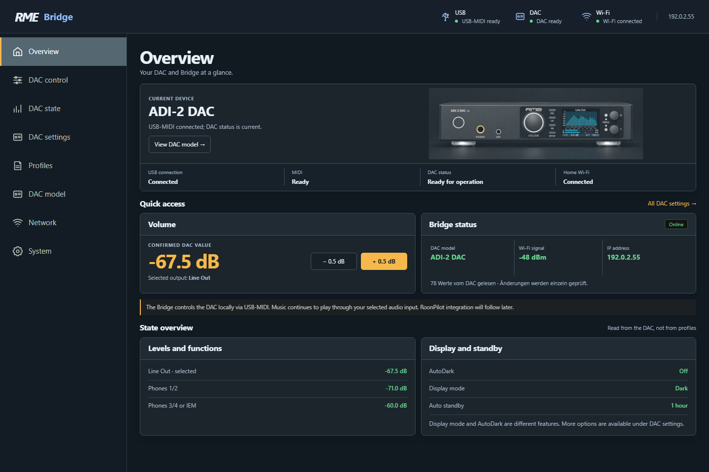
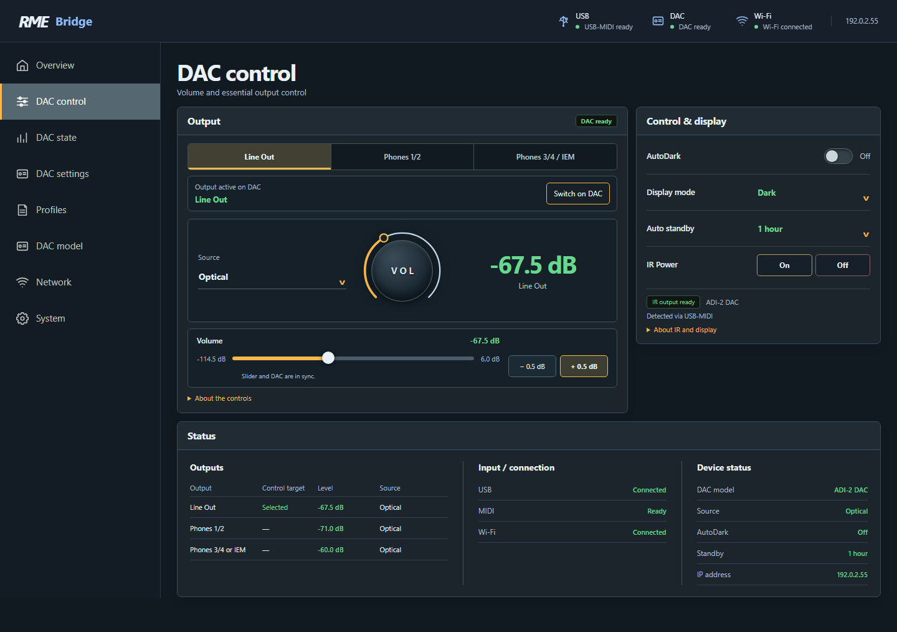
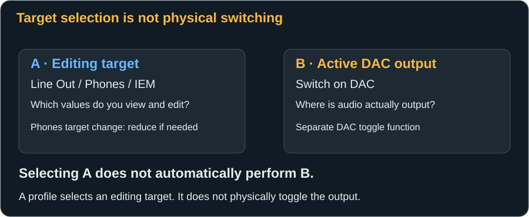
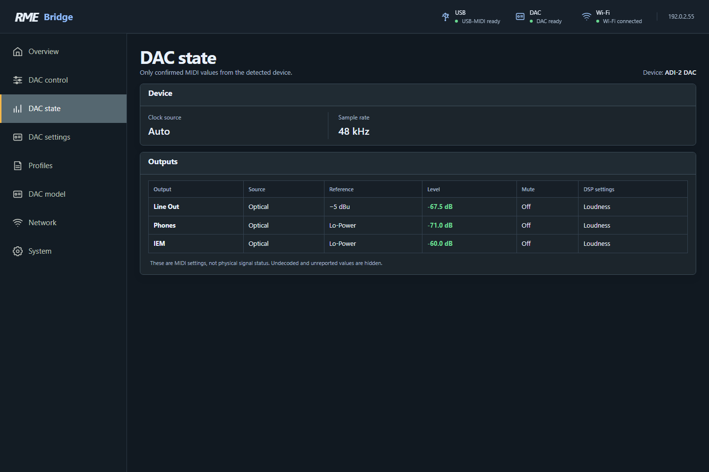
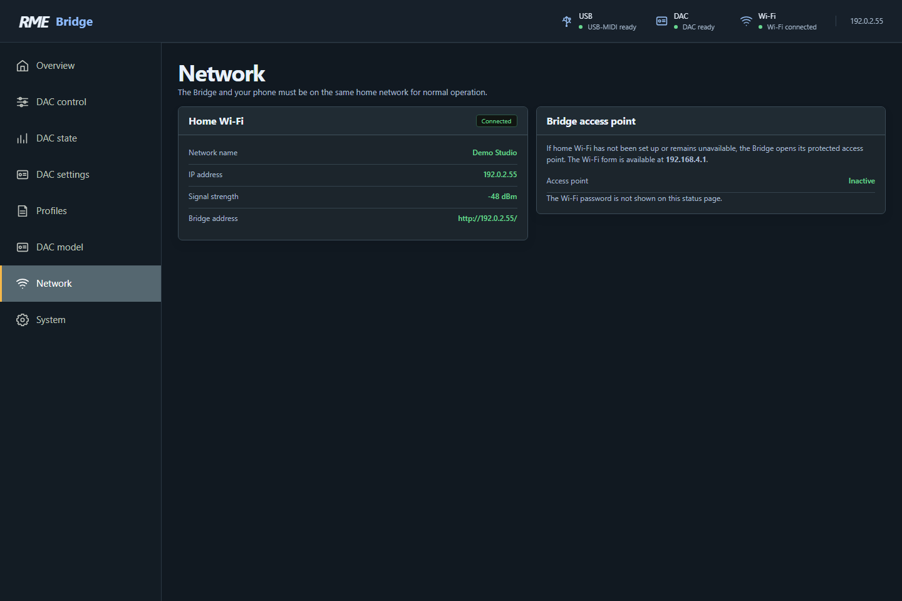
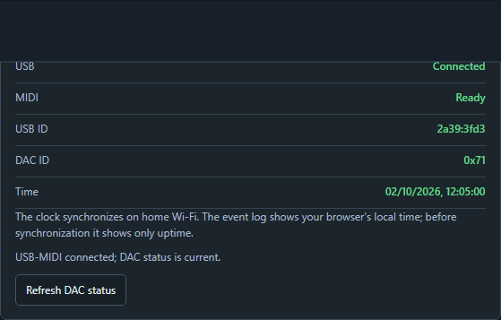
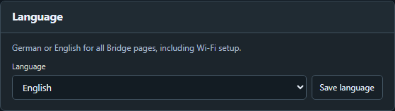
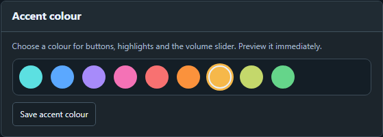
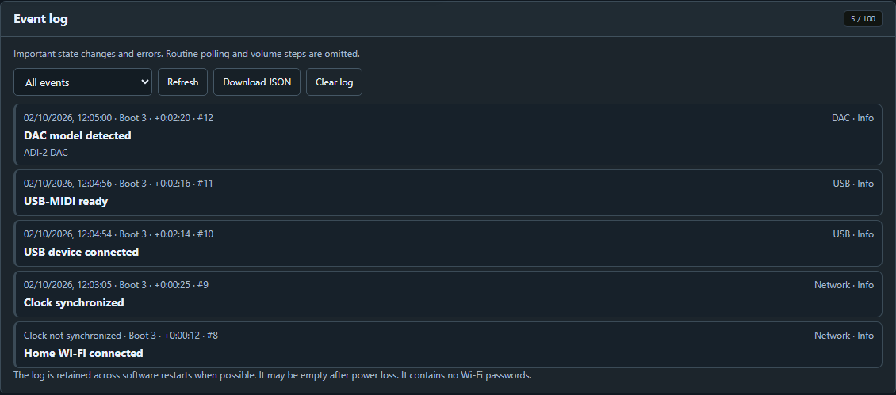
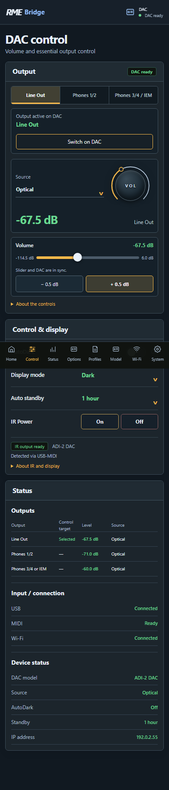

# The web pages in detail

[← First start](first-start.md) · [Next: DAC settings →](dac-settings.md)

Open your Bridge's home-network IP in a browser. The Bridge serves the page itself. The DAC needs no Wi-Fi connection of its own; the Bridge links Wi-Fi operation to USB-MIDI.

## Navigation

On a computer, the menu is on the left. A phone has compact navigation at the bottom. The shorter mobile names lead to the same sections. Changing pages does not change a DAC setting.

| English desktop | Deutsch | Mobile, English | Contents |
|---|---|---|---|
| Overview | Übersicht | Home | Device, connections, levels and shortcuts |
| DAC control | DAC-Steuerung | Control | Volume, editing target, switching, AutoDark and IR power |
| DAC state | DAC-Zustand | Status | Read-only, model-specific state overview |
| DAC settings | DAC-Einstellungen | Options | Output, Input, Device and Display |
| Profiles | Profile | Profiles | Capture, compare, apply and back up snapshots |
| DAC model | DAC-Modell | Model | Automatic detection, probe preference and IR model |
| Network | Netzwerk | Wi-Fi | Home network and setup access |
| System | System | System | Diagnostics, language, accent colour and event log |

The top status bar shows **USB**, **DAC**, **Wi-Fi**, and the IP on larger screens. Green indicates an available connection; a warning may mean a USB device was detected without usable MIDI. Not every status field fits a narrow screen; Overview and System contain the full information.

Most settings act immediately when operated. Ordinary DAC commands have **no extra confirmation dialog**. “Confirmed by DAC” means the subsequent technical readback, not another question for you. Deleting or replacing stored data still requires confirmation.

## Overview

**Current device** shows the model identified over MIDI and its image. USB, MIDI, DAC and home Wi-Fi are separate indicators, making it possible to distinguish a working network from a responding DAC.

The volume section displays the confirmed value for the selected editing target and offers **±0.5 dB** shortcuts. **Bridge status** shows the model, Wi-Fi signal, IP and read-value status. The count of DAC values is not a percentage and differs between models.

**Levels and functions** summarises reported outputs. **Display and standby** shows AutoDark, Display Mode and Auto Standby. This page is a useful starting point for observation, but its volume buttons are real controls.

## DAC control

### Which output are you editing?

The upper **Line Out**, **Phones 1/2**, and **Phones 3/4 / IEM** buttons select the **control/editing target**. An ADI-2 DAC actually has **Line Out**, **Phones**, and **IEM**. On Pro models the headphone paths are Phones 1/2 and Phones 3/4; device modes can link their behaviour.

This selection also applies on the settings page. For example, you can edit IEM settings while listening to Line Out. Selection alone does not physically switch the output.

When **changing** to a Phones target, the website reads its confirmed volume. If it is louder than **−60 dB**, it lowers it in confirmed steps to −60 dB. An already quieter value stays unchanged. This is a real volume change on that headphone path even if it is not currently audible. Selection completes only once the level is known and any required reduction is confirmed by the DAC. This is not a permanent volume limit: afterwards you can deliberately raise the level.

### Physically switch the active DAC output

The separate **“Active output on DAC”** section displays the DAC-reported active output. **“Switch on DAC”** is a different action from choosing one of the three editing targets.

On the ADI-2 DAC FS:

1. In **DAC settings → Device → Headphones → Mute Line Out with headphones**, set **Toggle** or **Plugged in**. These correspond to **Toggle Ph/Line** and **Toggle plugged** at the DAC; you can also set them there.
2. Both headphone paths, Phones and IEM, need known, confirmed levels of **−60 dB or lower**. If necessary, select each editing target in turn and wait for its reduction. −71 dB already meets the condition; −40 dB is too high to enable switching.
3. Press **Switch on DAC** once. The DAC follows its own toggle configuration. Connected headphone plugs can influence which sockets it considers.
4. Wait for confirmation of the new active output. The editing target then follows it. Check both displays before adjusting further.

Check the displayed state: missing levels or an unsuitable toggle configuration must be resolved first. On Pro models, DAC settings contains the headphone options for that model and operating mode. If switching is unconfirmed, do not click repeatedly: it may already have happened.

### Volume and the two numbers

The **large dB number** is the DAC-confirmed actual value. The value **beside the slider** previews your target while moving it. The circular **VOL** ring is a graphical level display here, not an additional interactive knob. Adjust volume with the slider or ±0.5 dB buttons. The three Loudness knobs in DAC settings are interactive.

Move the slider slowly or quickly. The target updates immediately and the DAC follows through confirmed steps. Actual and target values can differ briefly. Individual commands increase by at most 1 dB or decrease by at most 3 dB; the website automatically divides a larger move. Normal volume steps generate neither bottom-right success messages nor an event-log flood.

Avoid simultaneous conflicting adjustments in another browser or at the DAC's knob. An unexpected reported value or lost connection can stop the sequence. Powering the DAC off and on does not automatically resend an old volume target.

### Source, display and standby

The **Source** display belongs to the editing target. Clicking it opens the corresponding output settings; opening the settings does not itself select a different input. **Display mode** and **Auto standby** similarly take you to the right settings section.

**AutoDark** acts immediately: Off keeps the DAC display visible; On lets it blank after inactivity while audio continues. The dark **Display Mode** instead changes the DAC display's appearance. **Auto Standby** is an actual automatic DAC power-saving function. These are three different things.

### Power on and off over IR

**IR Power → On / Off** sends the built-in power code for the known DAC model. These buttons operate the DAC, not the Bridge. The transmitter must be [connected correctly](installation.md#connect-an-optional-ir-transmitter) and aimed at the DAC.

The line beneath the buttons identifies the IR model source: current USB-MIDI identification, manual preference or last detected model. A connected DAC's confirmed identity takes priority. An IR command requires the correct model to be known. With a previously identified or correctly selected model, **On** can work while the DAC is off.

“IR output ready” means the Bridge's signal output is available. It does **not** detect whether a transmitter is actually attached or the DAC has line of sight. Green transmitter status is not a range test. A send confirmation only proves the IR command was output. A subsequent MIDI response proves the DAC is reachable again; conversely, missing MIDI alone does not conclusively prove that it is off.

Off uses a separate model-specific command. You do not need to hold the website button, even though the original remote uses a long press on Power to turn off. The Bridge does not check playback or amplifier state before sending Off. Repeated **On** is not an off-toggle command.

### Status beneath the controls

This section shows reported output levels and sources, USB/MIDI/Wi-Fi and basic device settings. “Selected” means the editing target, not “audible audio is coming from this socket”. Open **DAC state** for the more detailed read-only view.

## DAC state: The SOV-style view

This page follows the idea of RME's State Overview, not its exact pixel layout. It is **read-only**. Only MIDI values that are actually available and can be meaningfully decoded for the identified model appear.

**Device** shows items such as clock source and sample rate; Pro models can also report Basic Mode. **Outputs** contains source, reference, volume, Mute and available DSP switches. “EQ”, “B/T”, “Loudness” or “Crossfeed” describe settings, not real-time proof of their effect at every sample rate. Displaying EQ status does not enable EQ editing.

There are no invented bit-depth, digital-sync or generic “Output On” indicators. Unreported values remain blank or hidden. When a DAC goes offline, live values disappear rather than presenting an old copy as current. This browser view is not a real-time audio analyser.

## DAC settings

Choose an output, then open **Output / Input / Device / Display**. Switches, segmented buttons, lists, sliders and Loudness knobs act on the relevant option immediately. **?** opens model-specific help; another click, clicking outside, **×**, or Escape closes it.

An input menu is only applicable to a model with analogue inputs. The ADI-2 DAC therefore does not show Pro input features. Missing or invalid settings are not presented as editable values. [The next chapter explains every section and the more complex functions](dac-settings.md).

## Profiles

Manage up to eight named snapshots here. **Save** reads a current state and stores it on the Bridge; it does not write it back to the DAC. **Apply** does operate the DAC. **Restore backup** only replaces the profile library; it never automatically applies a profile.

The preview helps you identify differences. Including volume is off by default, although a necessary change of editing target to Phones can still trigger its safety reduction. [See the profile chapter for workflows and backup limits](profiles.md).

## DAC model

Automatic identification probes the three RME families in sequence. **Automatic** is the normal choice. The actual response determines the name, commands and displayed values.

Manual selection saves a **probe and IR preference**. The next USB detection tries that family first. The identity reported by the DAC determines its settings; selecting a picture does not replace a MIDI connection. If a DAC is already connected, probe order changes at the next USB detection.

To use IR On before first identification, manually select the **actual** model you own. With a DAC connected, its detected identity takes priority over that preference for commands. A mismatch is shown on the page.

## Network

**Home Wi-Fi** lists network, IP, signal strength in dBm and the Bridge hostname. Among negative dBm readings, a number nearer zero indicates a stronger signal. It is not a throughput measurement or response-time guarantee.

**Bridge access point** indicates whether protected setup Wi-Fi is active. Wi-Fi configuration is available only there. To change credentials, follow [the setup procedure](first-start.md#changing-wi-fi-later). Neither home-network nor AP passwords appear here. The hostname helps identify the Bridge in a router; start with the displayed IP instead of assuming `.local` name resolution.

## System

### Connection and time

USB ID and DAC ID help identify the connected device. **Refresh DAC status** requests another read; it neither restarts nor resets the DAC.

The Bridge synchronises time automatically over SNTP once home Wi-Fi has an IP and the time server is reachable. The log displays dates/times in the **browser's time zone**, including that zone's daylight-saving rules. The Bridge has no separate manual clock or time-zone selector. Before synchronisation, time is explicitly unknown; boot number and uptime remain useful.

### Language and accent colour

**Save language** stores German or English on the Bridge, including setup. It does not change the RME DAC's language and is not merely a per-browser choice.

The nine accents are Cyan, Blue, Violet, Magenta, Red, Orange, Amber, Lime and Green. Clicking previews a colour immediately. Only **Save accent colour** makes it persistent. This affects the Bridge website and setup page, not DAC meter colours. Blue is the default.

### Event log

The log records important starts, Wi-Fi/USB changes, model detection, command problems, IR transmissions and changes to stored Bridge data. Routine polling and normal volume steps are omitted. **Issues only** hides information events; **All events** is often better for reconstructing a sequence.

**Refresh** reads the log again. **Download JSON** saves the read events to a diagnostic/support file. **Clear log** removes stored events after confirmation; it is not a configuration reset.

The ring holds **100 entries**; new events eventually replace the oldest. Identical events can be grouped with a repetition count. It is retained across software restarts where possible, but is not a permanent archive. It can be empty after power loss. Download important events before disconnecting power.

Date/time, **Boot**, **+uptime**, and **#sequence** help place an event. Boot identifies a start session, uptime counts from that start, and sequence orders log events. Entries recorded before initial time synchronisation are not assigned invented timestamps later. Downloads contain no Wi-Fi passwords; still inspect other screenshots for private information.

## On a phone

Modules stack vertically. Scroll to reach lower functions and use the fixed navigation. A knob in **DAC settings** responds to vertical dragging; your finger does not need to trace a circle. Help opens as a readable panel in the available screen area. Stay on home Wi-Fi for normal use; the Bridge Wi-Fi is for setup or recovery.

[Next: Understand DAC settings →](dac-settings.md)
